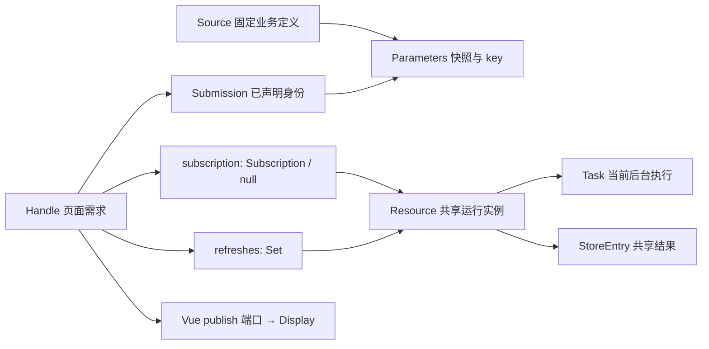

# vue-refresh 设计与实现

本文件维护设计与实现：模块划分、数据模型、参数与结果边界、调度与竞态、生命周期适配、顺序约束。
业务规则、公共 API 契约、验收目录与决策门槛的正式定义在 [统一刷新管理文档](./统一刷新管理.md)。

## 1. 模块划分与依赖

工程目录：`vue-refresh/`。运行时分层：

```text
public-types.ts            公共类型唯一代码定义；不依赖运行时模块
diagnostics.ts             诊断出口与返回值观察；零依赖叶子
model.ts                  内部模型：Handle / subscription / refreshes / Submission / Resource / Task / 端口
source.ts                 固定资源定义、提交边界准备与稳定键、只读定位
delivery.ts               结果复制、observer 诊断、onError 通知隔离
store.ts                  Pinia 结果分区适配
scheduler.ts              后台调度：唯一 Timer、FIFO 队列与并发槽位；只经 ScheduleHost 端口回调
vue.ts                    组件适配：配置快照读取、句柄、配置 watcher、生命周期、Display
app.ts                    应用安装、浏览器可见性、公开只读快照、销毁
manager.ts                Manager：状态观测、页面操作、资源关系、后台执行、调度入口、释放
index.ts                  包入口（只导出三个正式函数与公共类型）
```

依赖方向单向：`public-types`/`diagnostics` ← `source`/`model`/`delivery` ← `store`/`scheduler` ← `manager` ← `vue`/`app`。
核心不依赖 Vue、Pinia 或 HTTP。这条方向由 `pnpm check:docs` 校验：**运行期边必须严格向下**，同层或向上的运行期边
必须同时在 `check-docs.mjs` 与本节登记，否则直接失败；类型回边只报告（运行期被擦除）。
`diagnostics.ts` 是零依赖叶子：结果边界（`delivery.ts`）与参数边界（`source.ts`）都要上报，
挂在任何一侧都会让另一侧横向依赖。`delivery.ts` 与 `source.ts` / `model.ts` 同层，因为它们只依赖公共类型与内部模型。
唯一被登记的等层运行期边是 `vue.ts → app.ts`：组件适配只需要安装器提供的注入键 `managerKey`，
而这个键必须在 `provide` 之前存在，因此它留在安装器里；二者之间没有别的运行期共享。

核心拆成两个文件：`manager.ts` 按职责分成八个分段：状态观测、页面操作、需求关系、后台执行、刷新要求、调度入口、有效性与身份、释放；
唯一的 Timer、FIFO 队列与并发槽位归 `scheduler.ts`（L2），它是「何时、按什么顺序执行」的唯一所有者。

## 2. 模块职责

| 文件 | 职责 |
|---|---|
| `source.ts` | 固定定义、冻结快照与稳定键、只读定位 |
| `delivery.ts` | 结果复制、通知异常隔离（诊断出口与返回值观察在 `diagnostics.ts`） |
| `diagnostics.ts` | `FrameworkIdentity`、`reportObserverError`、`observeRejection`；零依赖 |
| `vue.ts` | 配置快照读取以 `createConfigurationBinding` 为唯一入口（快照、通知去重、watcher 三件事在同处），加句柄建立、生命周期与 Display 绑定；配置绑定只经 `ConfigurationHost` 窄端口（2 项事实）访问编排层 |
| `store.ts` | 分区替换、删除与私有 Store 释放 |
| `app.ts` | 安装绑定、可见性监听、只读快照、销毁 |
| `scheduler.ts` | 唯一 Timer、FIFO 队列、真实并发槽位、活跃 Resource 遍历；只经 `ScheduleHost`（5 项事实）回调编排层 |
| `manager.ts` | 声明接纳、刷新要求、Resource 生存期、共享任务、交付与释放；调度入口转发给 `scheduler.ts` |
| `model.ts` / `public-types.ts` | 内部模型 / 公共类型的唯一代码定义 |
| `index.ts` | 包导出 |

### 2.1 调用链路

适配层只提交「配置快照」和「参数准备动作」，资格、共享、调度与交付全部在核心：

```text
useRefresh（组件 setup）
  ├─ 配置变化 → readConfiguration → Input 快照 → manager.reconcile（按资格撤销或保留订阅）
  ├─ submit   → manager.submit → 新 declaration（operationId）→ prepareParameters
  │                            → Submission → requestFlush
  ├─ refresh  → manager.refresh → 入口闸（销毁／配置非法／失活或隐藏／无身份）
  │                            → resourceFor（必要时建实例）→ RefreshWaiter（minVersion）
  │                            → 无当前任务时登记一次共享任务
  └─ 生命周期 → onMounted / onActivated → manager.activate → lifecycleActive=true → reconcile
                onDeactivated → manager.deactivate；onScopeDispose → removeHandle

reconcile  = synchronize ＋ requestFlush（两步必须分开，见 manager.ts 注释）
flush      → 逐句柄 synchronize ＋ attach → enqueueDue（一趟同时收齐到期入队与下次唤醒）→ startQueuedTasks → setWakeup
             （前两步与最后一步由 Manager 经 ScheduleHost 提供，队列与 Timer 在 Scheduler 内）
synchronize→ 失去存在时结算本页刷新要求；订阅按 eligible 决定保留或释放；改频率只更新间隔
             eligible / allowed / present 是「环境是否允许」的唯一判定处，调用点不再各写一遍
attach     → 要求已声明身份、无订阅且 eligible → resourceFor（Source＋key 建或查实例）→ Subscription
             → 交付已有 entry；没有 entry 时由调度器的到期遍历登记首查
refresh    → 入口闸 → resourceFor → RefreshWaiter{minVersion = 在动作之后启动的版本} → 无当前任务则 enqueueTask
refreshFloor → 无任务取 issuedVersion；任务在排队取它的版本；任务在执行取 version+1
refillWaiters→ 任务结算后仍有未满足要求且没有当前任务时，补一次后继请求
settleWaiter → 从两侧集合移除后结算 success／error／cancelled；无人订阅与要求时销毁实例
enqueueTask→ 分配新版本 → 登记 Task（全部调用点都确认没有当前任务，因此不替换、不 abort 在途）
startTask  → source.load → copyResult → publishResult（记录时间、写 Store、按收货方 deliver）
                                     └ publishError（逐有效订阅 notify，并按失败结算刷新要求）
releaseSubscription → 退订；最后一个订阅与刷新要求都退出时删除实例、分区与排队任务
readSnapshot    → 算 key → 读分区 → 独立副本（不建实例、不保活）
```

需求侧对应：`U01/U03` → `submit`、`commitDeclaration` 与 `sameIdentity`；`U04` → `refresh` 入口闸与附条 A 的刷新要求；
`U05/U06/U10` → `refreshFloor`／`refillWaiters`／`settleWaiter`；`U07/U18/U25` → 配置快照与 `eligible`；
`U08/U21` → `releaseActivity`、`removeHandle`、`dispose`；`U11–U14` → `enqueueTask` 与 `Scheduler` 的 `flush`、`dueAt`、`enqueueDue`；
`U15/U19` → `publishError`、`notify` 与 observer；`U16/U17` → `deliver` 与 `readSnapshot`。

## 3. 数据模型

### 3.1 对象关系



Source 的生命周期是应用定义；Resource 的生命周期从首个有效订阅到最后退出。
两者不能因名字相似而合成一个可变对象。
`Subscription` 是周期需求，`RefreshWaiter` 是一次性刷新要求：两者互不排斥，可同时挂在同一 Resource 上，交付时按句柄去重。

### 3.2 身份与版本域

- Source 对象身份 ＋ `Parameters.key` 定位 Resource；`Resource.id` 区分同 key 的不同生存期。
- `Handle.operationId` 区分声明代次；`Resource.issuedVersion` 分配共享任务版本（存的是**最后一个已分配**的版本，下一次分配取 +1）；
  `Task.version` 与 `DeliveryBarrier.minVersion` 处于同一 Resource 版本域。
- 任务版本只在同一 Resource 内比较，跨 Resource 由 `id` 隔离；
  句柄声明代次不能替代任务版本，刷新要求与本页身份也不共用计数。
- 序号域足够大，取值按安全整数上界假设：三个计数器同处一个量级（单页每毫秒一次提交也要约 28.5 万年才耗尽），
  因此耗尽不是产品行为，不写进 §3；实现里它统一复用 `Manager.dispose`，不新增故障状态。

### 3.3 持久字段与唯一所有者

类型形状由代码维护（`src/model.ts`、`src/source.ts`）；本表只维护所有权、初值与释放时机。

| 所有者 | 字段、初值 | 写入与释放 |
|---|---|---|
| Source | `load`、可选 `validate`；定义时冻结 | `defineRefresh` 唯一建立；所有使用方释放引用后回收 |
| Parameters | `args`、`key`；准备成功后只读 | 提交边界复制/冻结/编码；需求与运行实例释放后回收 |
| Handle | `operationId=0`、`submission=null`、`subscription=null`、`refreshes` 空集合、`cleanup=null`、`lifecycleActive=false`、`disposed=false` | 全部写入都在 `manager.ts` 内：声明与关系由 Manager 写，生命周期走 `activate` / `deactivate`，`cleanup` 走 `setHandleCleanup`；适配层只读 `operationId` / `disposed` / `subscription`。`source` / `readInput` / `publish` / `onError` 为固定端口；`enabled` 只被读取，框架从不写入 |
| Submission | `parameters` | Manager 校验通过后才建立；同身份重复声明幂等保留，新身份整体替换，校验失败不改动 |
| Subscription | `owner`、`resource`、`every` | `attach` 建立双向关系；`synchronize` 只更新频率；`releaseSubscription` 解除 |
| RefreshWaiter | `owner`、`resource`、`minVersion`、`settle` | `refresh` 创建并同时挂到句柄与实例两侧；原生 Promise 首次结算生效，无 settled 镜像；结算或取消后从两侧移除 |
| Resource | `id`、`source`、`parameters`、`subscribers` 空集合、`waiters` 空集合、`issuedVersion=0`、`task=null`、`lastSettledAt=null` | Manager 建立与修改；最后一个订阅与刷新要求都退出时移除注册及 Store；创建后参数不被新加入者改写 |
| Task | `resource`、`version`、`controller` | `enqueueTask` 创建（同一资源同时至多一个当前任务）；`Scheduler` 的 `queue` / `running` 记录位置，finally 释放真实运行位置 |
| StoreEntry | `version`、`data`、`updatedAt` | 当前有效后台成功时整条替换，时间取提交那一刻的墙钟；最后退订删除；Store 不放任务或取消对象 |
| Display | 初始 `null`，发布 `args` / `data` / `origin` / `updatedAt` | Vue `shallowRef` 整体替换；时间来自产生该结果的那次提交，不随后续交付改写；临时退出保留，组件卸载释放，Manager 不镜像保存 |
| Manager | `handles` / `resources` 空集合；`issuedResourceId=0`（同样存最后一个已分配的序号）；`cleanup=null`；`browserVisible=true`；`disposed=false`；持有 `scheduler` | **全部 `private`**：外部只能走命名操作（`addHandle` / `removeHandle` / `activate` / `deactivate` / `setBrowserVisible` / `setCleanup` / `setHandleCleanup` / `cancelRefresh` / `reconcile` / `requestFlush` / `submit` / `refresh` / `readSnapshot` / `dispose`），读取走 `inspect()` 的只读投影与 `isDisposed()`。`dispose` 先失效再清理；排队的任务当场作废，已启动的 running 等真实结束 |
| Scheduler | `queue` / `running` 空集合；`cancelTimer=null`；`flushPending=false`；构造时注入 Resource 注册表 | **全部 `private`**：对外只有 `add` / `cancel` / `release` / `requestFlush` / `inspect` / `dispose`；回到编排层只经 `ScheduleHost` 的 5 个回调（销毁、协调句柄、登记任务、任务身份、执行任务）。销毁事实由该端口的 `isDisposed()` 现读，不另存镜像字段 |
| Clock | `now`（单调，调度）、`timestamp`（墙钟，交付时间）、`setTimer` 返回取消函数 | Vue 闭包拥有平台 Timer ID，Scheduler 只持有取消能力；两个时间域不互相替代 |
| 配置快照与通知状态 | `snapshot.current`（配置快照，初值无效）、`reported`（`false`） | 字段名见 `vue.ts`；只在 Vue 适配闭包内，随组件作用域释放。`snapshot.current` 同时是 `Handle.readInput` 返回的唯一事实，核心不重新调用 getter。适配层不保存 `enabled` 的历史：边沿不参与任何决策 |

### 3.4 事件与主流程

| 事件 | 同步转换 | 后续动作与重入边界 |
|---|---|---|
| `submit` 接纳 | 只推进 `operationId`；校验通过后才建立新声明、释放被替换的订阅与刷新要求 | 校验失败不改动任何状态；旧 abort / Store 通知可能重入，替换后复核代次 |
| 准备参数成功 | 保存 Parameters 作为已声明身份 | 参数准备只执行一次；`validate` 结束后复核代次 |
| 配置变化 | Vue 先更新快照，核心按资格撤销或保留订阅（改频率只更新间隔） | `onError` / abort 可能重入；判断函数本身无外部效果 |
| `refresh` 接纳 | 建立刷新要求（版本下限）并在没有当前任务时登记一次共享任务 | 与自动刷新同一条路径；不复制第二份 DTO |
| `refresh` 退出 | 结算 `unavailable`，移除要求，保留已声明身份 | D01 恢复按订阅规则，不重放刷新、不重新准备参数 |
| 后台成功 | 准备副本、记录结束时间与产生时间、写 Store、交付给有效订阅与满足门槛的刷新要求 | 每次外部写入后复核当前 Task、订阅与要求 |
| 最后退出 | 删除注册、清 task、删排队项与分区 | 最后一个订阅与刷新要求都退出才销毁；abort 旧 `load`，running 等 finally |
| `dispose` | 先置 `disposed`，再释放句柄、注册、队列、Store 与 Timer | 幂等；迟到执行只能清自己的 running |

### 3.5 十条必须成立的不变量

1. `subscription` 只能是 `Subscription` 或 `null`，`refreshes` 只包含仍挂在本实例上的刷新要求；旧执行闭包不等于当前订阅或当前要求。
2. 对外通知及入口返回时，`h.subscription === s` 当且仅当 `s.resource.subscribers.has(s)` 且 `s.owner === h`；对刷新要求同理（`h.refreshes` 与 `resource.waiters` 两侧一致）。退订再加入必换 Subscription 对象，内部更新期间不暴露半完成关系。
3. 注册表只指向当前生存期的 Resource；首次 `attach` 在暴露任何回调前绑定非空订阅；销毁先从注册表移除。
4. 每次调度或设置 Timer 都用当前 `subscribers.every` 的最小值；Resource 不缓存 interval，关系变化不逐条扫描聚合。
5. Resource 至多一个有效 `task`；Task 至多在 `Scheduler` 的 `queue` / `running` 之一；已失效的 running 可继续占槽但不可写。
6. 新后台提交要求注册身份、当前 Task、未取消成立；历史快照交付不依赖 Task 存活，但要求当前 entry、Subscription 与门槛成立。
7. StoreEntry 只来自该 Resource 的有效成功；删除后旧请求不得重建该 id 分区。
8. 只有共享路径写 Store 与交付 `display`；Display 的 `args` / `data` / `origin` / `updatedAt` 同次发布，DTO 与 Store 无可变别名；核心不另存 Display。
9. 当前 Task 的正常成功/失败在必要数据准备之后、外部通知之前更新 `lastSettledAt`；取消及旧 Task 不更新；`running.size` 只随真实执行开始/结束变化。
10. `dispose` 后 handles / registry / queue / 分区 / Timer / 监听已清，私有 Store 已释放；未结束的 running 先隔离，到真实 finally 才移除。

### 3.6 刷新要求的唯一更新表

`RefreshWaiter` 是 `{owner, resource, minVersion, settle}`，只代表一次显式刷新尚未满足；它不是 `Handle` 的第二个状态，
也不是订阅的一部分。`minVersion` 只比较客户端任务版本，不承诺服务端数据强一致。

| 事件 / 当前值 | 刷新要求更新 | 结果与交付规则 |
|---|---|---|
| `refresh` 且实例没有当前任务 | 新建要求，`minVersion = resource.issuedVersion`；登记一次任务 | 任务启动即满足「动作之后启动」；成功时结算 `success` |
| `refresh` 且当前任务在排队（未启动） | 新建要求，`minVersion = 该任务的版本` | 不追加请求：排队任务已经算「动作之后启动」 |
| `refresh` 且当前任务已启动 | 新建要求，`minVersion = 该任务版本 + 1` | 不 abort 在途任务；它结束后由 `refillWaiters` 补一次后继请求 |
| 同一个实例上多个未满足要求 | 各自保留，携带相同或不同的 `minVersion` | 任务成功时结算所有 `minVersion ≤ 本次版本` 的要求，更高的留待后继任务 |
| 任务成功 | 满足门槛的要求结算 `success` 并移除 | 先交付（含仅由刷新要求产生的接收者），再结算；同一句柄只交付一次 |
| 任务失败 | 该实例全部未结算要求结算 `error` / `background` 并移除 | 旧画面保留，订阅与开启意愿保留，下个周期继续 |
| 页面退出 / 暂停边沿 / 卸载 / 销毁 | 相应要求结算 `cancelled`（`unavailable` / `disposed`）并移除 | 取消立即结算，不等底层结束 |
| 实例再无订阅与要求 | 随最后一个要求移除而销毁实例（分区、排队任务、abort） | 与「最后需求退出即清理」一致，不引入 TTL 或历史缓存 |

刷新要求不携带 DTO：结果仍只经 `display` 交付；`refresh` 的 Promise 只报结算。
需要按结果写业务 Store 的页面在自己的适配层完成，框架不代管业务副作用。

**失败结算的是该实例全部未结算的要求**，包括 `minVersion` 高于本次失败任务的那一个：一次失败的含义是
「这次刷新没拿到新结果」，不为它保留后续代次（否则等待者会悬在一个不会自动重试的路径上）；
订阅与开启意愿都保留，下个周期由 `lastSettledAt` 驱动继续。`success` 则相反，只结算
`minVersion ≤ 本次版本` 的要求，更高的留在集合里等后继任务。

**唯一的不变量。** 上表的全部规则可以由一条不变量表达：**存在未满足刷新要求的实例，必有一个版本
不低于这些要求下限的任务**（没有当前任务就登记一个；排队中的任务若版本已达下限即已满足），任务结束时结算。
它替代了旧的「尚欠／已登记／无要求」三态与转换表：要求的存在本身就是要求，不存在就是没有要求，不做状态机。

两处必须写明，否则按字面读会做错：

- 「登记一个」的前提是**该实例没有当前任务**（`refresh` 与 `refillWaiters` 都先确认这一点），否则会重复登记；
- 失败时结算该实例**全部**未结算要求（含下限高于本次任务的那一个），否则「仍有未满足的要求」会立刻触发
  再登记，变成失败即自动重试，与「失败保留画面、下个周期继续」冲突。

### 3.7 派生值：不重复保存

- `Task` 的执行阶段由 `Scheduler` 的 `queue` / `running` 归属决定。
- 有效最短 `every` 由 `subscribers` 计算，不缓存。
- 刷新要求的版本下限由当前任务是否已启动现算（`refreshFloor`），不保存「上一次刷新」之类的镜像。
- 资格由存活、已声明身份、生命周期与浏览器可见性、配置快照四组事实决定，不镜像 `enabled`；
  刷新要求不参与资格，由 `refresh` 的入口闸与 `waiters` 归属表达（见 U25 与本文件 §2.1）。
- 不增加 `ready` / `blocked` / 第二调度器 / 独立恢复标志。
- 不交付「正在刷新」这类实时状态：它必须随任务开始/结束与资格变化另行发布，等于第二条反应面；
  交付面只给结果与它的产生时间（`updatedAt`），失败由通知通道给出。
- `null` DTO 是有效结果，`undefined` 表示没有快照，`Display=null` 表示尚未展示。
  StoreEntry 与 Display 不是镜像：共享成功写前者并交付给有效接收者，暂停页保留后者，不因刷新恢复订阅。

---

### 3.8 状态取值与存放

状态字面量的唯一来源是 3 个公开常量对象枚举：`RequestOrigin`、`ErrorOrigin`、`CancelReason`
（`public-types.ts`），以及只在核心内部使用的 `ActivityKind`（`model.ts`）。
`RefreshErrorOrigin` 不单独维护常量对象，它是 `ErrorOrigin` 去掉 `validation` 后的类型收窄：
刷新入口的配置失败与共享请求失败都不会是参数校验失败。
`SubmitCancelReason` 同理，是 `CancelReason` 去掉 `unavailable` 后的收窄：两处都由常量对象推导，
不手写字面量，因此成员重命名或删除时类型会一起报错。
结果判别式（`status`）不单独枚举 —— 判别联合本身就是这份枚举。不使用 TS enum：`erasableSyntaxOnly` 与 Node 的类型擦除都不接受该语法；
枚举成员在构建时被常量折叠，调用点使用成员不产生运行时开销。

下表列出全部状态域及其存放位置。
「推导」表示不保存该状态，每次由其他事实现算。

| 状态域 | 取值 | 存放 |
|---|---|---|
| 请求来源 | `refresh` / `background` | `RefreshDisplay.origin`，每次发布的事实（按接收者判定：本次刷新满足其要求则为 `refresh`） |
| 结果产生时间 | 墙钟 epoch 毫秒（不保证单调，校时可能回拨） | `StoreEntry.updatedAt` → 交付时进入 `RefreshDisplay.updatedAt`；与调度的单调时间 `Resource.lastSettledAt` 是两个域；相对时间由页面自行把差值钳制到 0 |
| 错误来源 | `background` / `validation` / `configuration` | `RefreshError.origin`，通知时的事实 |
| 刷新失败来源 | `background` / `configuration` | `RefreshResult` 的 error 分支 |
| 取消原因 | `superseded` / `unavailable` / `disposed` | `RefreshResult` 的 cancelled 分支 |
| submit 取消原因 | `CancelReason` 的可达子集：`superseded` / `disposed` | `SubmitResult` 的 cancelled 分支；子集由 `SubmitCancelReason` 从常量对象推导（`Exclude` 掉 `unavailable`），不手写字面量 |
| 刷新要求 | 无 / 待满足（版本下限 `minVersion`） | `Handle.refreshes` 与 `Resource.waiters`（两侧一致） |
| 当前订阅 | Subscription / null | `Handle.subscription` |
| 配置快照 | 有效 / 无效；无效时 `enabled`、`visible` 可为 `null`（读不到） | Vue 闭包 → `Handle.readInput` |
| 组件激活 | true / false | `Handle.lifecycleActive` |
| 句柄已释放 | true / false | `Handle.disposed` |
| 浏览器可见 | true / false | `Manager` 私有 `browserVisible`，由 `setBrowserVisible` 写入；读 `inspect().visible` |
| 待唤醒调度 | 已排 flush 微任务 true / false；Timer 取消函数 / null | `Scheduler` 私有 `flushPending` / `cancelTimer`（同一轮调度的两半）；读 `inspect().pendingFlush` / `inspect().scheduled` |
| Manager 已销毁 | true / false | `Manager` 私有 `disposed`；读 `isDisposed()` |
| 资源已结算 | 时间戳 / `null`（从未结算） | `Resource.lastSettledAt` |
| 当前后台任务 | Task / `null` | `Resource.task` |
| 任务执行位置 | 排队 / 执行中 / 两者都不是 | **推导**：`Scheduler` 的 `queue` / `running` 集合归属 |
| 有效最短间隔 | 正安全整数 | **推导**：现算各 `Subscription.every` 的最小值 |
| 订阅资格 | 是 / 否 | **推导**：`eligible()` 的四组事实（存活／已提交／环境允许／配置开启），不镜像 `enabled`；独立查询由调用点分流；这条推导是统一文档 U25 的唯一实现落点 |

框架身份（`operationId` / `resourceId` / `taskVersion`）不属于这份状态表，也不进公开契约：
`RefreshError` 只交付 `origin` 与 `error`；身份只在 `reportObserverError` 的诊断事件里用于日志关联。
只有可归属于某次页面操作的诊断事件才带 `operationId`，尚无操作时该键缺席——`0` 不表示「操作 0」。

## 4. 参数与结果边界

### 4.1 参数准备与键

固定 Source 绑定 `P`、`T`、`load` 及可选同步 `validate`。输入是应用构造的普通 JSON 记录：
根为对象，嵌套值为 `null` / `boolean` / `string` / 有限 number（不含 `-0`）/ 普通记录 / 稠密数组。
调用方不传 Proxy、访问器、隐藏字段、Symbol 键或特殊容器；框架不承诺对这些违约输入逐类探测。

提交边界**一次**执行：

```text
structuredClone → 在副本上检查 JSON 值域与循环并冻结 → fast-json-stable-stringify 编码
→ 可选 Source.validate 一次 → Parameters
```

核心接收参数准备闭包并在操作接纳之后调用，只有成功结果进入 Submission。
轮询、恢复与交付都复用该 Parameters。

- 深度守卫是内部安全边界（1000 层，根容器记 1）：只有循环引用或病态嵌套会命中，
  它是防止无限递归的实现不变式，不是可配置的产品承诺。
- 原生复制失败与守卫命中都归 `validation`。
- `validate` 每次接纳提交执行一次；轮询、恢复、`readSnapshot` 都不执行。

### 4.2 只读定位

`parameterKey` 只遍历值域与深度并编码，不复制、不冻结、不执行 `validate`。
`readSnapshot` 在适配边界计算键后交核心查找；`disposed` 直接返回 `undefined`。
它只交付值、不承诺新鲜度：需要结果产生时间就走 `display`（订阅会建立 Resource）；这是它与交付面的分工，不是缺少能力。
对象键排序、数组原顺序；完整键不使用短哈希，也不从参数推导 `Resource.id`。

### 4.3 数据所有权

- DTO 业务校验由 `load` 所在的 HTTP 适配器负责。
- 框架 `copyResult` 拒绝 `undefined` 并执行 `structuredClone`；不做原型白名单、自有描述符、循环或复制后形状复核。
- 原生支持的 `Date` / `Map` / 循环等可被复制，**不表示**框架验证了业务合法性；不支持的值由原生复制抛错，沿用共享请求失败（`background`）处理。
- Store → 每页 / `readSnapshot` 分别复制；不冻结业务原对象，不用 JSON 来回 `parse`。
- 退订冻结依靠独立数据快照，不能直接绑定共享 Store 对象，也不能只复制最外层对象。
  共享请求内部不得先写业务 Store 再让框架检查有效性。

### 4.4 复杂度

- 参数提交：复制一次、JSON 域遍历一次并冻结副本、稳定编码一次、可选业务 `validate` 一次。
  按值展开参数规模记 K，字段排序记 S，成本 `O(K+S+V)`；重复引用按值展开，不保证对压缩对象图的线性处理。
- DTO 入站复制 `O(D)`，k 页交付 `O(kD)`；Store 每次更新复制整个条目表，`O(R)`，不声称为常数成本。
- 调度按句柄、资源和订阅扫描；FIFO 出队按任务数。
- 参数边界（G01：不设业务侧上限，已关闭）与规模结论（G04：已关闭）见[统一文档](./统一刷新管理.md) §5。

---

## 5. 调度、并发与竞态

### 5.1 一次 flush（`Scheduler`）

```text
清本次微任务标记并取消旧 Timer
→ 读一次时钟
→ 协调当前全部句柄并加入需求
→ 一趟遍历：到期 Resource 交给编排层登记任务，同时收齐剩下 Resource 的最早到期时间
→ 按 FIFO 和可用槽位执行
→ 按剩余需求设置一个最近到期 Timer
```

**本轮的到期判断只读一次时钟。** `dueAt` 接收这个读数，不在函数内再读一次：真实时钟在一次 flush
内会前进，两次读数会把「从未结算的 Resource 立即到期」变成 `due > now`，于是首次入队被推迟到
一个 0ms Timer（虚拟时钟下看不出来）。“立即到期”因此是确定性的：首次订阅在同一次 flush 内入队。
设置唤醒 Timer 时会重新读一次时钟来计算剩余延迟。

新追加的任务留到下一次 flush；满槽的队列等待真实执行结束唤醒，不自旋；
间隔超过平台 Timer 范围时分段等待。同一轮内的多次配置变化合并为一次 flush。

### 5.2 并发与任务替换

`Scheduler` 的 `queue` / `running` 是后台执行位置的唯一事实。替换任务时：
先建立新身份与交付门槛，移除旧排队项，新项排到队尾，然后才 abort 旧执行。

- abort 不释放物理槽位；finally 只删除自身在 `Scheduler.running` 里的成员，不清新 Task。
- 显式刷新与自动刷新共用 `queue` / `running` 与 `maxConcurrent`；满槽时排队，不绕过上限。
- 并发上限只约束尚未结束的框架 `load`；只有请求适配器的 Promise 真实反映底层完成，
  才能进一步保证浏览器侧请求数。不承诺服务器因 abort 立即停止。

### 5.3 结果有效性

需要复核身份的边界是：`await` 之后、abort 之后、用户 `validate` 之后、Store 写入之后、
Display 发布之后、`onError` 之前（调用方可能在其中同步改 `enabled` 或发起新操作）。普通只读判断不触发这些效果。

后台成功时先准备全部页面副本，再记录结束时间、写 Store、逐页发布；
每次外部发布之后，下一个接收者重新判断。历史结果不要求原 Task 仍存活，
但必须满足当前订阅或未结算的刷新要求，避免把更旧的结果重新交付给已经看到新结果的页面。

---

## 6. 生命周期与 Vue/Pinia 适配

### 6.1 配置快照与边沿

- watch 源只读 `enabled` / `every` / `visible`，各 getter 独立捕错；
- 核心只拿到电平快照，适配层不保留 `enabled` 的历史：`true→false` 与 `false→false` 无差别；
  它们必须同步、纯，并正确暴露响应式依赖。
- watch 同步回调先替换局部 configuration 快照，再处理错误阶段、同步 Manager。
- 核心 `readInput` 只返回该快照，不重新调用 getter。
- 快照是适配结果，不是可独立修改的第二份 `enabled` 意愿。
- 未知 `enabled` 不覆盖上次成功读值：`true→未知→false` 取消当时查询；
  `false→未知→false` 不误杀暂停期间的单次查询。
- `onError` 引发同步配置变化时以最新快照为准，旧 watch 回调不可再覆盖它。
- `every` 只接受正安全整数毫秒，不转换、不取整；非法值明确拒绝配置，不制造忙循环，也不伪装成网络失败。

### 6.2 生命周期

- `mounted` / `activated` 恢复资格，`deactivated` / scope dispose 撤销；
  两者可能交叠（KeepAlive），因此进入与退出都必须幂等。
- 浏览器隐藏同步退订，恢复仅在 `enabled` 仍为开时加入。
- 暂停后仍允许显式 `refresh`；`enabled` 边沿只按资格退订，不取消已发起的刷新要求。
- 生命周期取消不报查询失败、不修改开启意愿。
- 重新显示时：Resource 仍在则交付已有数据并按间隔调度；已删除则重建并首查。
  用户手动关闭时不恢复。
- 自定义页签由调用方提供响应式可见条件；初始隐藏时不得先请求再取消。

### 6.3 应用安装与 SSR

- 安装顺序固定为「先检查后修改」：被拒的安装不破坏已有合法绑定，也不新增框架监听或请求。
- 每个 Manager 只注册一个 `visibilitychange` 监听；无 `document` 时以 `setBrowserVisible(false)` 固定为不可见。
- 每个 App 只 `provide` 一次绑定对象；同 App 重建 Manager 时，旧实例已 `disposed` 则原地接管内容，仍活跃则拒绝。
  因此不出现重复 `provide`，也不存在指向旧实例的第二份归属记录。
- `dispose` 先失效再清理自身监听与资源；绑定对象保留已销毁实例，直到新实例接管或无人再注入。
- SSR 不创建浏览器监听、Timer 或请求；显式 Pinia 按应用/请求隔离。
- 重建（HMR、会话切换）不累积旧私有 Store 与 state，晚到任务不能重建分区。

### 6.4 通知隔离与后台失败

- `onError` 同步执行，返回的 Promise 拒绝立即观察但不等待，不阻塞其他接收者。
- 通知自身的同步或异步失败只进入固定 observer 诊断出口，不改变已结算结果、页面快照、
  开启意愿或调度；任务已被替换或 Manager 已销毁后的晚到失败同样只作诊断。
- 诊断只输出固定说明与框架生成的身份标识；不读取或序列化原始异常。
- 后台失败保留需求与开启意愿，旧画面不变，下个周期继续重试。
- 共享请求失败只结算并通知，不改写调用方 `enabled`；是否停止自动刷新由调用方在 `onError` 里决定。
  只要 `enabled` 仍为真，下个周期继续；暂停页仍可显式刷新一次。
- 同一规则适用于 refresh 与 background 的 `onError` 通知，以及 validation、configuration 的入口通知。
- 框架不合并业务提示；多个组件只需要一条提示时，由调用方统一呈现。

---

## 7. 顺序约束

1. **先建立新身份，再通知旧取消。** 新 Task 与版本、新 operationId、新 `subscription` 与新 `RefreshWaiter` 必须在 abort 之前就位。
2. **先让内部关系完整失效，再产生外部效果。** 退订先解绑与删注册，再删分区，最后 abort。
3. **外部效果之后复核身份。** `await`、复制结果、发布 Display、写 Store、`onError`（调用方可能在其中同步改 `enabled`）。
4. **旧清理只清自己。** 旧任务的 finally 只释放自己的 running 成员。
5. **资格判断无副作用。** `eligible` / `registered` / `currentTask` / `currentSubscription` / `deliverable` 只读事实。
6. **物理槽位只随真实结束变化。** abort 不释放槽位；`running.size` 等于尚未结束的 `load` 数。
7. **配置只读快照。** Vue 同步 watch 是唯一写入者。

## 8. 验证

`pnpm typecheck` → `pnpm test` → `pnpm build` → `pnpm build:demo` → `pnpm test:browser`；
`pnpm complexity` 输出每文件与函数的行数、结构分支、圈复杂度和嵌套深度；
`pnpm check:docs` 的 12 项一致性门禁，清单与各项动机以 `scripts/check-docs.mjs` 的自述注释为准。
实际执行环境与已通过项见 [README](./README.md)「实际验证与边界」。
测试预期属于契约，修正测试前先确认契约。
