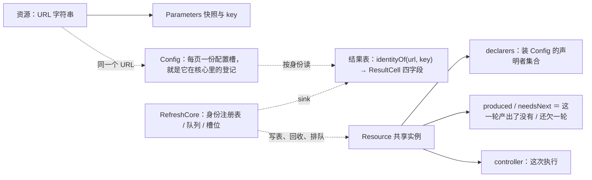
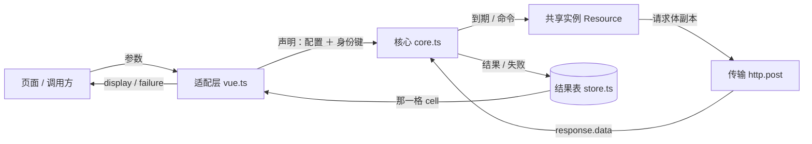
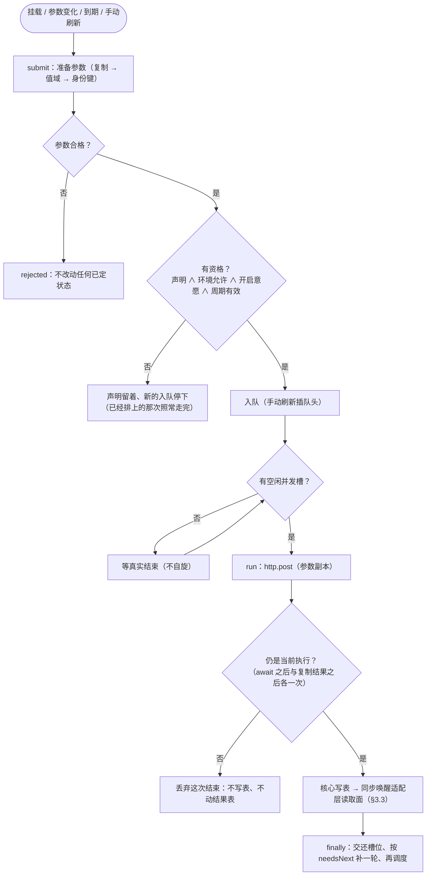
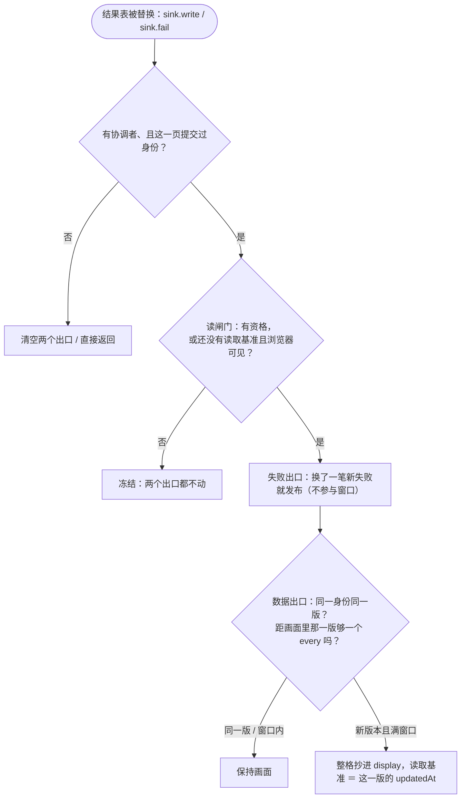

# vue-refresh 设计与实现

**这份文档回答三件事**：**§1 整体架构**——设计依据（约束与目标）、设计方案（五个支点）、分层与模块、不变量；
**§2 数据流设计**——对象关系、数据流总览、身份与参数、字段与所有权、状态取值、读取面与两个出口、观测面；
**§3 流程设计**——一次取数与三条关键路径、调度与并发竞态、结果发布、刷新命令、事件与主流程、配置槽与生命周期、安装与销毁、需求锚点落点。
之后是 **§4 顺序约束**、**§5 验证**，附录是读码入口（A）与符号索引（B）。

**它不写什么**：对外承诺（行为、取值、判据）的正式定义在 [统一刷新管理文档](./统一刷新管理.md)；
取舍理由、被否方案与历史在 [ADR.md](./ADR.md)。本文只写**结构与算法**——字段与符号一律用表、一行说清，
不复述理由、也不重抄条文；两者冲突时以《统一刷新管理文档》§3／§4 为准。文中括注的 ADR 号是决策记录，细节在那里。

**需求与设计的对应**见 §1.6：规格的 R1–R6 与十条根承诺各自落在哪一节，反向指针写在各节开头的「> 需求：」行上。

**读代码从附录 A 开始**：三条进入路线、读之前先记住的七个词、遇到 `if` 时按什么读；符号一句话作用在附录 B。
`src/core.ts` 的五个 `═══` 分段与 §1.3 的分工一一对应（`pnpm check:docs` 第 11 组断言两边的名字与顺序一致）。

## 1. 整体架构

### 1.1 设计依据

**需求侧输入**：产品场景、行为要求与验收判据在[统一刷新管理文档](./统一刷新管理.md)——§1 讲场景与目标，§3 的 R1–R6 是全部行为要求
（共享结果与身份、声明与调度、读取面与失败、显式刷新、参数边界、隔离与工程边界），§4 是判据。本文只回答「怎么做到」。

**技术约束**（硬约束，违反即不可交付）：

| 约束 | 由来 |
|---|---|
| 宿主是 Vue 3 SPA，一个进程只允许一个活跃协调者 | 结果表挂在调用方的 `pinia` 上，页面经组件适配层接入（单活跃 SPA 口径） |
| `vue` 与 `pinia` 是 peer 依赖；核心不依赖 Vue，也不 import HTTP 客户端 | 取数实例由 `createRefreshManager` 注入，核心只调它的 `post` |
| 本包自身的类型自 TypeScript 4.9 起可用于消费 | G03：声明文件要在 TS 4.9 的 module/moduleResolution Node16 ＋ strict 下零错误 |
| 运行期只多一个零依赖包（`fast-json-stable-stringify`） | 参数键的确定性编码 |
| 框架不执行任何调用方回调 | 核心零回调，提交边界只做参数准备 |

**规模与质量目标**：并发上限由调用方给（`maxConcurrent`），框架不设内部截止；调度按身份现算、不缓存派生值；
`src/` 的行数、分支与复杂度、包体积的现行值与门禁见 README「实际验证与边界」与 [工程约定.md](./工程约定.md)。

**明确不做**：不做查询库、缓存层或事务层；不做第二个数据出口；不把结果落进业务 Store（要落由页面在自己的适配层做）。

### 1.2 设计方案（五个支点）

整个实现由五个结论支撑，后面每一节都是它们的展开：

1. **一个身份一本账**：身份 ＝ 取数 URL ＋ 参数键；一个身份在核心里只有一个共享实例，它的 `declarers` 就是「谁在要」的唯一事实——
   没有第二份名册，也没有从配置槽指回实例的反向字段（§2.3、§2.4）。
2. **声明与资格分离**：声明（挂载期间一直在）决定实例与结果的生死；资格（声明还在 ∧ 环境允许 ∧ 开启意愿 ∧ 周期有效）每次现算，
   只决定要不要自动取数——所以暂停、失活、隐藏都不撤销任何东西，恢复时不需要重建（§1.5、§3.6）。
3. **结果表是唯一真值，两个只读出口**：一条结果只写一格，页面按已声明身份读同一份对象；数据与失败分两个出口，
   失败不参与数据窗口，因此「成功过的身份上持续失败」不会静默（§2.5、§3.3）。
4. **读取面由写入事件驱动，只记一个数**：结果表写入同步唤醒页面的读取副作用；读取面只保留「上次读取时间」，
   用 `updatedAt` 时间差实现「按本页 `every` 节流 ＋ 同一身份同一版不抄第二遍」；三处不等窗口（身份落定、重新成为读者、显式 `refresh()`）
   都是「没有时间就直接读」（§1.5 第 12 条、§3.3）。
5. **职责单一、核心零回调**：核心只做声明、资格、共享执行、调度与写表；实例只持自己的字段与判定、不持有核心；
   传输与结果表都是注入端口（§1.3、§2.7）。

文中括注的 ADR 号是该结论的**决策记录**，理由与历史在那里，本文不复述。

### 1.3 分层、模块与依赖

工程目录：`vue-refresh/`。运行时分层：

```text
public-types.ts            公共契约类型（判别联合，没有常量对象）；不依赖运行时模块
source.ts                  参数边界：准备（复制、值域检查、稳定键）
resource.ts                一个身份自己的状态与判定（每页一份的 `Config` 配置槽 ＋ `Resource` 类）
core.ts                    跨实例的协调者（身份注册表、队列与并发、调度）
store.ts                   结果表（Pinia 模块级定义）：一张复合键 Map（`identityOf(url, key)`），整条替换，随实例释放即删
vue.ts                     组件适配与安装：配置槽原地改写、生命周期、可见性、读闸门、结果表接线
index.ts                   包入口（两个函数与 6 个公共类型；没有常量对象）
```

依赖方向单向：`public-types` ← `source` ← `resource` ← `core` ← `store` ← `vue` ← `index`。
核心不依赖 Vue 或任何状态库，也不 import 任何 HTTP 客户端：取数用的 axios 实例由 `createRefreshManager` 注入，
`core.ts` 只调它的 `post`。**`store.ts` 是唯一 import Pinia 的模块**，核心只经 `ResultSink` 的四个动作碰结果表。运行期只依赖 `fast-json-stable-stringify`（零依赖，参数键的确定性编码）。这条方向由 `pnpm check:docs` 校验：
**运行期边必须严格向下**，同层或向上的运行期边必须同时在 `check-docs.mjs` 与本节登记，否则直接失败；
类型回边只报告（运行期被擦除）。本版没有需要登记的例外边。

`core.ts` 按职责分成五个分段：状态观测与生命周期、页面操作、身份注册表、后台执行、调度。
全部可变状态分三处：跨实例的挂在协调者上（身份注册表、队列与并发、唯一唤醒 Timer），
一个身份自己的在 `Resource` 类里（声明者、这一轮的结果产出了没有、到期与当前执行），**结果住结果表**（`store.ts`，唯一真值）；
实例不持有核心——写表、回收、排队都是核心的动作（ADR-65）。
`vue.ts` 只读公开入口、模块级单例（当前协调者与结果表）与结果表的读出口，`source.ts` 是无状态函数的边界。


工程目录：`vue-refresh/`。运行时分层：

```text
public-types.ts            公共契约类型（判别联合，没有常量对象）；不依赖运行时模块
source.ts                  参数边界：准备（复制、值域检查、稳定键）
resource.ts                一个身份自己的状态与判定（每页一份的 `Config` 配置槽 ＋ `Resource` 类）
core.ts                    跨实例的协调者（身份注册表、队列与并发、调度）
store.ts                   结果表（Pinia 模块级定义）：一张复合键 Map（`identityOf(url, key)`），整条替换，随实例释放即删
vue.ts                     组件适配与安装：配置槽原地改写、生命周期、可见性、读闸门、结果表接线
index.ts                   包入口（两个函数与 6 个公共类型；没有常量对象）
```

依赖方向单向：`public-types` ← `source` ← `resource` ← `core` ← `store` ← `vue` ← `index`。
核心不依赖 Vue 或任何状态库，也不 import 任何 HTTP 客户端：取数用的 axios 实例由 `createRefreshManager` 注入，
`core.ts` 只调它的 `post`。**`store.ts` 是唯一 import Pinia 的模块**，核心只经 `ResultSink` 的四个动作碰结果表。运行期只依赖 `fast-json-stable-stringify`（零依赖，参数键的确定性编码）。这条方向由 `pnpm check:docs` 校验：
**运行期边必须严格向下**，同层或向上的运行期边必须同时在 `check-docs.mjs` 与本节登记，否则直接失败；
类型回边只报告（运行期被擦除）。本版没有需要登记的例外边。

`core.ts` 按职责分成五个分段：状态观测与生命周期、页面操作、身份注册表、后台执行、调度。
全部可变状态分三处：跨实例的挂在协调者上（身份注册表、队列与并发、唯一唤醒 Timer），
一个身份自己的在 `Resource` 类里（声明者、这一轮的结果产出了没有、到期与当前执行），**结果住结果表**（`store.ts`，唯一真值）；
实例不持有核心——写表、回收、排队都是核心的动作（ADR-65）。
`vue.ts` 只读公开入口、模块级单例（当前协调者与结果表）与结果表的读出口，`source.ts` 是无状态函数的边界。

### 1.4 模块职责

| 文件 | 职责 |
|---|---|
| `public-types.ts` | 公共契约类型（判别联合，没有常量对象）：数据出口、失败出口、句柄、协调者、选项与提交结果 |
| `source.ts` | 参数边界：`Parameters`、`assertJsonValue`（值域检查：对象型限普通对象或数组）、`prepareParameters`（复制 → 值域检查 → 稳定编码，消费者各拿副本；**不跑任何回调**）、`parameterKey`；`P` 的值域约束 `JsonParameters` 也在这里，由 `useRefresh` 的类型参数使用；稳定编码用 `fast-json-stable-stringify` |
| `resource.ts` | `Resource`：一个身份自己的状态与判定（声明者、这一轮是否已产出／是否还欠一轮、到期、当前执行、成功与失败结算），**不持有核心**——写表、回收、排队都是核心的动作（ADR-65）；`Config`：**一页在核心里的登记**——每页一个可变配置槽，适配层原地写、核心只读（ADR-66） |
| `core.ts` | `RefreshCore`：跨实例的协调者——身份注册表、唯一 Timer 与有序队列（手动刷新插到队头）、并发槽、结果表写入端与读取口 |
| `store.ts` | 结果表：模块级 `defineStore`，一张复合键 Map（`identityOf(url, key)` → `ResultCell` 四字段），`shallowRef` 整条替换；写入端给核心（`write` / `fail` / `remove`），读出口 `read` 由适配层的读取面经核心的 `readResult` 取用，`list` / `size` 给观测面 |
| `vue.ts` | `useRefresh`（每页一份 `Config` 配置槽、公开 `RefreshHandle`、指向结果表的 Display、**读闸门**、生命周期）、`createRefreshManager`（安装、可见性监听、结果表接线、销毁） |
| `index.ts` | 包导出：两个函数、逐个列出的 6 个公共类型（不用 `export type *`）；工具型别名不导出 |

### 1.5 必须成立的不变量

> 需求：R1–R6（横切）

每条注明**由谁保证**：读代码时按符号定位，不必自己反推。括号里是该条的决策记录。

| # | 不变量 | 由谁保证 |
|---|---|---|
| 1 | 声明关系只有一处事实：`Config` 在某实例的 `declarers` 里 ⟺ 这一页声明了该身份；**资格不另存集合** | `submit` / `undeclare` / `Resource.isEligible`（ADR-57、ADR-61、ADR-66） |
| 2 | 注册表只指向还活着的实例；实例被删后不再被遍历、也不接受新声明或刷新命令 | `resourceFor` 建立、`releaseIfUnused` 删桶 |
| 3 | 每次调度在**有资格的声明者**里现算 `every` 最小值；没有有资格的声明者就不取数、不安排唤醒 | `Resource.dueAt` / `eligibleEvery` |
| 4 | 一个实例至多一个当前执行；位置由 `queue` / `running` 表达，「这次还算不算数」另存 `Resource.controller`（`null` ＝ 没有或不算数）；abort 不释放槽位 | `enqueue` / `dequeue` / `startQueued` / `run` 收尾 / `releaseIfUnused`（ADR-56、ADR-62、ADR-65、ADR-70） |
| 5 | 结果只来自该实例当前执行的成功；实例删除后旧请求不得重建该实例 | `run` 的两处 `isCurrent` 复核；`Resource.settle` 只被它调用 |
| 6 | 结果只由共享路径写入结果表，写进去与读出来是**同一个对象**（要改自己复制）；`display.args` 每次抄写复制一份 | `run` 的 `sink.write` / `sink.fail`（ADR-59、ADR-65） |
| 7 | 正常成功/失败在写结果表之前更新 `settledAt`；取消与旧执行不更新 | `Resource.settle` 的第一行 |
| 8 | 一个身份只保留一份参数对象；**核心不回写这份参数给页面**——`display.args` 来自适配层自己那份副本 | `resourceFor` 采纳（ADR-52、ADR-66） |
| 9 | `dispose` 之后配置、注册表、队列、结果表条目与 Timer 已清（核心不持有监听或回调）；未结束的执行到真实结束才移除 | `dispose` → 清空 `declarers` → `releaseIfUnused` |
| 10 | 注销只发生在声明空时，且空实例再也拿不到新的边 | `releaseIfUnused` 是唯一注销点 |
| 11 | 有资格 ⟹ 配置槽有效：`enabled` 为真、`present` 为真、`every` 是正安全整数 | `Resource.isEligible` |
| 12 | 两个出口各有粒度：**数据出口**由「身份落定／重新成为读者／显式 `refresh()`／一次写入且距画面里那一版满一个 `every`」触发，同一身份同一版不抄第二遍；**失败出口**换一笔新的失败即发、不受窗口限制 | `vue.ts` 的 `publishData` / `publishFailure`（ADR-63、ADR-67、ADR-72、ADR-77） |
| 13 | 「读者」只在适配层判定：`isEligible(...) || (lastReadAt === null && !document.hidden)`，两个出口共用这一个闸门 | 适配层读闸门（ADR-66、ADR-67、ADR-72） |

### 1.6 需求与设计的对应

**规格 → 设计**：规格的六个能力域与十条根承诺各自落在哪些设计节（反向指针写在各节开头的「> 需求：」行上）：

| 规格 | 设计落点 |
|---|---|
| **R1 共享结果与身份**（`U01`–`U03`、G1／G2／G8） | §2.1、§2.2、§2.3、§3.5 |
| **R2 声明与调度**（`U04`–`U09`、G3／G4／G5） | §1.5、§2.4、§2.6、§3.1、§3.2、§3.5、§3.6 |
| **R3 读取面与失败**（`U11`–`U13`、G7／G11） | §2.2、§2.5、§2.7、§3.3 |
| **R4 显式刷新与共享取数**（`U14`、G6） | §3.1、§3.2、§3.4 |
| **R5 参数边界**（`U15`、G02） | §2.3 |
| **R6 隔离与工程边界**（`U16`–`U18`、G10） | §2.7、§2.8、§3.7 |
| **G01 参数规模** | 已关闭（不设上限）：无实现落点，见 §1.1「明确不做」 |
| **G03 版本范围** | §1.1（本包声明自 TS 4.9 起可用这一条硬约束） |
| **G04 设备性能** | §2.8（复杂度）；规模与实测值见 [工程约定.md](./工程约定.md) |
| **判据 `A01`–`A21`** | 判据与证据在规格 §4 与测试；本文件不重复，逐叶子的落点见 `scripts/trace-leaves.mjs` |

**分工**：规格写「要什么」（行为与判据），本文写「怎么做到」（结构、算法、字段），ADR 写「为什么这么裁」。
本文的每一节都以一行「需求：…」标注它服务哪些条目；规则与判据的措辞一律以规格为准。

## 2. 数据流设计

### 2.1 对象关系

> 需求：R1、U02、G2



`Config` **就是这一页在核心里的登记**：每页一个对象、适配层原地改写，谁声明了这个身份 ＝ 这个对象挂在哪个实例的
`declarers` 里。`Resource.parameters` 是**实例建立时用的参数**（框架私有权威副本）；页面侧的「我按哪个身份读」
由适配层自己持有的身份键现查结果表得到。声明关系**只有一处事实**——实例侧 `declarers` 的成员资格，
配置槽上没有指向实例的反向字段，`resourceOf` 换身份时扫描注册表，所以不存在「两侧一致」这类需要维护的不变量（ADR-57、ADR-66）。
**`Resource` 也不持有核心——配置与实例都不指向核心**：写表、回收与排队都是核心越过去做的动作，因此三方之间没有环（ADR-65）。
**声明与资格是两件事**：声明由挂载/卸载与身份变化驱动；资格（声明还在、环境允许、开启意愿、周期有效）只决定要不要取数，
现算、不维护第二份集合（ADR-61）。**「读者」不是核心的概念**：核心只回答 `isEligible` 一个只读判定，
页面在这一拍上跟不跟随由适配层的读闸门自己算（ADR-66）。

`Resource` 是**类**而不是字段集合：一个身份内的状态与判定都定义在它自己身上，核心不替它做决定；
实例**不持有核心**，核心也不需要中间接口——写表、回收与排队都是核心越过去做的动作（ADR-65）。
**`Resource` 是合并请求、排队与终止的单位**：同一个「URL ＋ 参数值」只有一个实例（合并发生在 `resourceFor`），
一次执行只属于它、只在核心的 `queue`／`running` 里排队，取消（abort）与回收也只在它身上发生（ADR-66）。
**结果不在实例上**：它住结果表，读的人按已声明身份自己取，因此没有「回调交付」这一步，也没有逐个接收者的副本（ADR-59）。

### 2.2 数据流总览

> 需求：R1、R3、U01、U11–U13、G2、G8

一次取数里**谁把什么交给谁**（主干一条，边上的字就是流过去的东西）：



- **参数**：从页面到传输每经一手复制一份——`args` 外发给消费者、`display.args` 每次抄写再一份（`structuredClone`）。
- **结果**：只在入站复制一次（`copyResult`），此后所有人读到的都是结果表里那**同一个对象**，要改自己复制。
- **资格不流动**：它是每次现算的判定（页面报三个值，核心与适配层各自算一次），所以图上没有这条数据。

### 2.3 身份与参数

> 需求：R1、R5、U01–U03、U15、G1、G2、G02

- URL（一个字符串）＋ `Parameters.key` 定位实例（声明不再有对象或函数，ADR-75）；同一个 URL 与同一份参数值就是同一个实例，因此两处各写一份定义也照样合并。实例的生存期只由声明决定（最后一个声明者离开就回收）。
- **没有第二套计数**：执行与结果都不记版本或代次，读取面也不带「由谁触发」的标记
  （ADR-43 删掉等待者的版本下限、ADR-45 删掉任务版本、ADR-47 删掉声明代次）。

#### 参数准备与键

资源就是「URL ＋ 参数值」这条身份：URL 与 `P`／`T` 都在 `useRefresh<P, T>(url, …)` 那一行写出，框架里没有声明对象。`P` 的值域由 `JsonParameters` 约束为 JSON 值（对象型只能是普通对象或数组，ADR-52），提交边界再由 `assertJsonValue` 运行期兜底：`Date`／`Map`／`Set`／`RegExp`／`ArrayBuffer` 等容器的内容对编码不可见，两个内容不同的参数会塌成同一个身份，故一律拒绝（`Date` 请传 ISO 字符串）。业务字段的合法性仍不归框架——那是调用方自己的事：它在 `submit` 之前自己判，框架不替它跑回调（ADR-74）。编码交给 `fast-json-stable-stringify`，标量沿用 JSON 语义：`-0` 与 `0` 同键，`NaN` / `Infinity` 按 `null`，`undefined` 字段按省略；函数与 Proxy 这类复制不了的值由 `structuredClone` 拒绝，循环引用让编码交不出身份。

提交边界**一次**执行；三步各由一个函数负责，没有共享、也没有需要冻结的副作用：

```text
structuredClone → assertJsonValue（值域：对象型限普通对象或数组）
                → stringify（`fast-json-stable-stringify`：键排序 ＋ 数组保序）
                → Parameters
```

对象按键排序编码，数组保持原顺序，因此字段顺序不影响身份、数组顺序影响身份。
**不设内部深度上限**：循环引用让编码交不出身份（`parameterKey` 返回 `null`），与复制失败一样按非法参数处理（`U15`）。
**框架没有业务回调接口**（ADR-74）：提交边界只有复制、值域检查与编码三步，没有 `validate` 这类准入回调；业务准入由调用方在 `submit` 之前自己判——输入是它自己的东西，离它最近。

### 2.4 字段与所有权

> 需求：R2、R3、U04、U11–U13、G4、G7

| 对象 | 字段 | 类型 / 初值 | 语义 |
|---|---|---|---|
| `Config` | `enabled` | `boolean`（`false`） | 开启意愿；调用方写、核心只读 |
| `Config` | `every` | `number \| null`（`null`） | 本页周期（毫秒）；`null` ＝ 这一拍配置非法 |
| `Config` | `present` | `boolean`（`false`） | 环境允许（这一页激活 ∧ 浏览器可见），适配层合成 |
| `Resource` | `url` / `parameters` | `string` / `Parameters` | 一个身份只保留一份参数对象（同键加入者复用） |
| `Resource` | `declarers` | `Set<Config>`（空集合） | 声明者；空即回收 |
| `Resource` | `produced` / `needsNext` | `boolean`（`false`） | 这一轮产出了没有 / 产出后又有人点过刷新 |
| `Resource` | `settledAt` / `controller` | `number \| null` / `AbortController \| null`（`null`） | 最近一次结算时刻 / 这次执行（`null` ＝ 没有，或这次结束已不算数） |
| 结果表 `cells` | 键 → 那一格 | `Map<string, ShallowRef<ResultCell \| undefined>>` | 键是 `identityOf(url, key)`；整格替换，格与 `ResultCell` 都当不可变用 |
| `ResultCell` | `data` / `updatedAt` / `error` / `failedAt` | 四个平字段 | 取值与含义见 §2.5 |
| RefreshCore | `identities` / `queue` / `running` / `wakeup` / `flushing` / `disposed` | 身份键 → 实例（`Map`）／待取顺序（数组）／在途集合（`Set`）／唤醒句柄或 `null`／两个布尔位 | 全部 `private`：外部只能走命名操作（`isDisposed` / `setConfig` / `submit` / `refresh` / `isEligible` / `readResult` / `undeclare` / `dispose`）；核心私有的动作与收尾顺序见 §3.2、§3.1 |

**所有权**：`Config` 一页一个对象，适配层原地改写、核心只读（唯一写入口 `setConfig`）；实例与结果表之间没有互指；
结果只住结果表（唯一真值），实例释放时连 ref 一起删。**登记就是声明**——`Config` 挂在哪个实例的 `declarers` 里，
这一页就声明了哪个身份，没有第二份名册、也没有反向字段（`resourceOf` 扫描注册表）。
核心不持有任何回调，可见性监听的拆卸由适配层自己做（§3.7）。

#### 数据所有权

- DTO 业务校验由取数所在的传输侧负责（本仓示例是 `demoHttp`，接入方通常是 axios 响应拦截器）。框架拿到的是
  `response.data`，只做结果边界检查（拒绝 `undefined`、原生复制），不做形状复核——因此畸形响应在框架看来是
  一次**成功**：它会覆盖旧结果。要不要挡住它，是传输侧的决定。
- 框架拒绝 `undefined` 并执行 `structuredClone`；不做原型白名单、自有描述符、循环或复制后形状复核。
- 原生支持的 `Date` / `Map` / 循环等可被复制，**不表示**框架验证了业务合法性；不支持的值由原生复制抛错，
  沿用共享请求失败处理；`null` 是有效结果。
- **失败也是那一格的事实**（ADR-63）：它不动最后一次成功的数据，只把 `error` 与 `failedAt` 换上；成功一到，`failedAt` 清回 `null`。
  页面在写入上**立刻**读到它（ADR-77 的失败出口，不参与数据窗口），所以「成功过的身份上失败被窗口挡住」这个缺口不存在；
  框架不引失败计数，也不给结果或发布引版本号与代次。
- **结果的读出口与参数不同**（ADR-59）：结果只复制一次（入站 `copyResult` 建立框架私有所有权），
  之后**所有人读到的都是同一个对象**——要改自己复制，只读视图由 `ReadonlySnapshot` 在编译期约束；
  不冻结业务原对象，也不用 JSON 来回 `parse`。代价说清楚：一个页面就地改它，其他页面与下一次读都跟着变。
- **参数仍是每个消费者各复制一份**（`structuredClone`，ADR-52）：提交边界复制一份作为框架私有权威副本，
  每一轮请求体各拿一份，`display.args` 每次读取也复制一份，因此页面写自己的 `display.args` 改不到
  下一轮请求的参数或身份键所描述的值。**隔离不靠冻结**：`Object.freeze` 冻的是
  属性描述符，而 `Map.set` / `Set.add` / `Date.setTime` 写的是内部槽，规范上冻不住——既然私有副本不外发，
  就不需要「冻得住」这个假设。

### 2.5 状态取值与存放

> 需求：R3、U12、G8、G11

取值域直接写在 `public-types.ts` 的判别联合里，**没有常量对象**（ADR-51）：调用方比较裸字面量。
结果判别式（`status`）不单独枚举——判别联合本身就是这份枚举；单成员取值不立字段（`submit` 的取消分支不带原因）。

| 状态域 | 取值 | 存放 |
|---|---|---|
| 结果产生时间 | 墙钟 epoch 毫秒（不保证单调） | `ResultCell.updatedAt` → 读出口把它带进 `RefreshDisplay.updatedAt`；与调度的 `settledAt` **用的是同一个墙钟**（一次取数里那个 `at` 同时是结算时刻与结果时间，所以两者可以直接比较，不需要第二个时钟）；代价是墙钟被回拨时下一次到期会等到时钟追平（每轮 `flush` 读一次 `Date.now()` 交给 `dueAt`，`setWakeup` 再读一次） |
| 当前结果 | 每个身份一格 `ResultCell` / 没有 | **结果表**：`useRefreshStore().read(url, key)` 拿那一个 cell ref 的值；写由核心直接调 `sink.write` / `sink.fail`，删由 `releaseIfUnused`，读由页面按身份现查 |
| 这一轮的结果产出了没有 | true / false | `Resource.produced`：`settle` 在写表之前置起，`run` 的 `finally` 清回 false |
| 还欠一轮 | true / false | `Resource.needsNext`：`refresh` 在「有执行且已产出」时置起，`run` 的收尾读它并插到队头补一次 |
| 当前声明 | 声明着 / 未声明 | **推导**：这一页的 `Config` 是否在该实例的 `declarers` 里；`resourceOf` 扫描注册表（ADR-57、ADR-66） |
| 配置槽取值 | 有效 / 非法（`every === null`） | `Config` 字段：唯一写入口是核心的 `setConfig`（适配层给三个值），核心只读 |
| 环境允许（这一页激活且浏览器可见）、本页已释放、协调者已销毁 | true / false | `Config.present`（适配层合成后并进配置槽，ADR-61、ADR-87）/ 适配层的 `released`（核心不记名册）/ `RefreshCore.disposed` |
| 待唤醒调度 | 取消句柄 / `null`；已排 flush true / false | `RefreshCore.wakeup` / `flushing` |
| 资源已结算 | 时刻 / `null`（从未结算） | `Resource.settledAt` |
| 当前执行 | 有 / 没有 | `Resource.controller`（`null` ＝ 没有执行，或这次结束已不算数） |
| 执行位置 | 在队 / 在跑 / 被弃（在跑但已不是当前执行）/ 都不在 | `RefreshCore.queue` / `running`；「这次执行还算不算数」另存为 `Resource.controller`，两处只在 `enqueue` ／ `dequeue` ／ `startQueued` ／ `run` 收尾 ／ `releaseIfUnused` 里迁移（§1.5 第 4 条） |
| 有效最短间隔 | 正安全整数 | **推导**：现算各声明者的 `every` 最小值 |
| 取数资格 | 是 / 否 | **推导**：声明还在、环境允许（激活与可见合成在快照的 `present` 里）、开启意愿、周期有效（`Resource.isEligible`，ADR-61） |

### 2.6 派生值：不重复保存

> 需求：R2、U04、U07、G4

- 执行的位置由 `queue` / `running` 的归属决定；此外另存一个「本实例的当前执行」位 `Resource.controller`（它要回答的是「这次迟到的结束还算不算数」，不是位置）。两处只在 `enqueue` ／ `dequeue` ／ `startQueued` ／ `run` 收尾 ／ `releaseIfUnused` 里迁移，`controller === null` 同时表达「没有执行」与「这次不算数」（§1.5 第 4 条，ADR-65）。
- 下次到期时刻由 `settledAt ＋ 当前最短 every` 现算，因此改频率立刻生效；`settledAt` 本身是事实（最近一次执行有结局，成功与失败都算）。
- 有效最短间隔由各声明者的 `every` 现算，不缓存。
- 资格由「声明还在」「环境允许（这一页激活且浏览器可见）」「开启意愿」「周期有效」四组事实现算，不镜像 `enabled`，也不存第二份集合（`Resource.isEligible`）；其中「环境允许」由适配层合成快照里的 `present`（ADR-87）。
- 声明到哪个实例由该实例 `declarers` 的成员资格决定，配置槽上不存反向字段；`resourceOf` 换身份时扫描注册表（ADR-57、ADR-66）。核心不记「哪一页已释放」——那是适配层 `released` 的事实（§3.6）。
- 不提供「正在刷新」这类实时状态：读出口只给结果与它的产生时间。
- 「我该看到哪一条」不另存：适配层由自己持有的身份键现查结果表得到（ADR-59、ADR-66）。
- 「本页还跟不跟随结果表」不另存、也不问核心：适配层现判 `core.isEligible(config, url, key) || (lastReadAt === null && !document.hidden)`（ADR-60、ADR-66、ADR-72）。

### 2.7 读取面、读闸门与零回调

> 需求：R3、U11–U13、U16、G7、G11

- **核心拨出去的外部调用只有两个注入端口**：传输 `http.post(...)` 与结果表 `sink.write / fail / remove` / `read`——它们是适配层传进来的端口，不是页面回调。
  但**写结果表会同步唤醒页面的响应式副作用**（Vue 的行为）：页面 watcher 就在写入那一刻跑起来。
- **没有业务回调接口**：提交边界只做参数准备（复制／值域／编码），没有 `validate` 这类准入回调；业务准入由调用方在 `submit` 之前自己判，
  那里的抛错就地变成同步 `rejected`。框架自身不写诊断日志。
- **适配层只有一个标志**：`released`（`onScopeDispose` 置位）。读取面只有一个数 `lastReadAt`（上次读取时间，`null` ＝ 还没有读取过），核心不认识它。
- **读闸门在适配层**：`core.isEligible(config, url, key) || (lastReadAt === null && !document.hidden)`，两个出口共用这一个闸门。
  第二项只问「还没有读取时间」且浏览器**可见**（读 DOM 而不是那个 ref，避免把可见性登记成依赖）；环境（激活、配置有效、可见）
  在 `refresh` 的入口闸那一刻已经判过，之后失活仍允许它更新那一帧（§3.6 的角落）。失败出口与数据出口共用闸门，但**没有窗口**——
  失败不进画面只有一个原因：这一页此刻不是读者。
- 唯一 catch 不到的一类：传输拿到的 `AbortSignal` 上的监听器由宿主在 `abort()` 时同步调用，它们的抛错由宿主上报，不在承诺内。
- 后台失败保留声明与开启意愿，旧结果不变，下个周期继续；框架不改写调用方的 `enabled`。

### 2.8 观测面与复杂度

> 需求：R6、U18、G04

观测面不属于包契约，因此也不住在 `src/`：只读计数投影住在
开发侧的支撑模块 `scripts/observe.ts`（一个读核心私有账本的纯函数），不在 `src/`。它只有四个字段：实例数组 `resources`、
**结果表的一份扁平副本**（`results`：`url` / `key` / `cell` 三列，`cell` 是 `ResultCell` 的四个平字段 `{ data, updatedAt, error, failedAt }`）、排队与在途执行（`queued` / `running` 都是 `Resource[]`）。投影只有这四项：声明者列表可由 `resources.flatMap(r => [...r.declarers])` 现推，`scheduled` / `flushing` 是核心内部状态，都不投影。
集合是副本、元素仍是核心对象（比较身份是这些断言的要点），因此它是观察面而不是安全边界；
支撑模块每次越界读私有账本前先做形状校验，内部结构漂移当场抛错，而不是静默返回空。

结果那一项带 `url` ＋ `key`，所以两个 URL 用同一个参数键不会互相覆盖（ADR-46 删掉的是只按参数键拍平的字典）。
包本身仍然不提供「按身份读」的公开入口：**页面侧读的是自己的 `display`**（一个指向结果表的只读视图），
要用在别处就在页面自己的适配层里读它，框架不做第二个出口。

#### 复杂度

- 参数提交：复制一次、值域遍历一次、编码遍历一次（不再另复制一份给任何回调，ADR-74）。按值展开参数规模记 K，成本 `O(K)`；每次读 `display` 再复制一次参数，k 页即 `O(kK)`。
- DTO 入站复制 `O(D)`；结果不再逐页复制，读的人拿到同一份（ADR-59），因此没有 `O(kD)` 这一项；结果是整条替换，不维护增量结构。
- 调度按实例与声明扫描；出队按队列次序（手动刷新在队头）与可用槽位。
- 读取面按页计时：每页每次写入一次整格比较（`O(1)`）＋ 命中时复制一次参数（`O(K)`）；`every` 越大，抄写次数越少——慢页面的静态成本就是这个乘积。
- 规模结论见[统一文档](./统一刷新管理.md) §5 G04。

## 3. 流程设计

### 3.1 一次取数与三条关键路径

> 需求：R2、R4、U07–U09、U14、G3、G6

主干五步、四个判定；`refresh` 的三条分支不在图上，见 §3.4 的表。



- 「有资格」**只在入队那一刻**问一次；已经排上的取数照常走完。
- 失败路径与成功路径同形，只是进 `catch` 时再复核一次身份，写的是那一格的失败字段。

#### 三条容易卡住的路径

- **写表时的重入**：`run` 的收尾顺序是 `Resource.settle(at)`（记结算时刻、置 `produced`）→ 核心写表 → `finally`（交还槽位、清 `produced`、
  按 `needsNext` 插到队头补一轮）。写表会同步唤醒页面副作用，因此页面在那一拍里再点刷新时 `produced` 已经为真，命令落进「补一轮」
  那条分支、不会被本轮吃掉；同一轮内点几次合并成一个位。
- **最后退出与迟到的结束**：声明变空的唯一入口是 `undeclare`（`submit` 换身份与卸载都经它），它调 `releaseIfUnused`，只判 `declarers` 是否空
  ——暂停、失活、隐藏都不撤销声明，所以走不到这一步。注销做四件事：删注册、删结果表条目、撤销当前执行、`abort` 在途；
  在跑的那次标为**被弃**，它仍占着并发槽位直到迟到的结束自己交还（当场交还就会与后来者并发）；还在排队的执行同时从 `queue` 摘掉。
- **为什么不需要独立的执行对象**（ADR-65）：位置由 `queue` / `running` 表达，`Resource.controller` 一个字段同时回答**取消**（释放实例时 `abort`）
  与**认人**（`run` 在 `await` 之后、复制结果之后各复核一次），`controller === null` 同时表示「没有执行」与「这次结束已不算数」；
  请求必然终止由注入的传输负责（axios 的 `timeout`、反向代理或宿主自己的截止），框架不设内部截止。

### 3.2 调度、并发与竞态

> 需求：R2、R4、U08、U09、U14、G3、G6

```text
flush：清本轮标记（flushing = false）→ 已销毁则返回 → 取消旧 Timer（clearWakeup）
→ enqueueDue：一趟遍历，到期实例入队，同时收齐其余实例的最早到期时刻
→ startQueued：按队列次序和可用槽位启动（队列里的执行必是它实例的当前执行，不再复核）
→ 队列已空且仍有到期项时安排唯一唤醒 Timer
```

**这一轮只读一次时钟。** `Resource.dueAt` 接收这个读数，不在函数内再读一次：真实时钟在一次 flush 内会前进，
两次读数会把「从未结算的实例立即到期」变成「尚未到期」，于是首次入队被推迟到一个 0ms Timer。
新追加的执行留到下一次 flush；满槽时不自旋，等到执行真实结束后继续；间隔超过平台 Timer 范围时分段等待。

#### 并发与限流

- `queue` / `running` 是执行位置的唯一事实：`running` 统计真实尚未结束的请求，也就是并发槽。
- 显式刷新与自动刷新共用队列与 `maxConcurrent`；满槽排队，不绕过这个上限。
- **单次取数的截止由注入的传输负责**（axios 的 `timeout`、反向代理或宿主自己的截止）：
  axios 的 `timeout`、反向代理，或宿主自己的截止。一个永不结束的请求会永久占住一个并发槽，
  直到它自己结束；框架不设内部截止，也不承诺「挂死请求不会拖住一个并发槽」。
- 实例被释放后这次执行迟到的结束在身份复核处被判无效：不写结果、不动结果表；但它仍占着槽位。
- 因此 `maxConcurrent` 约束的是**在途请求数**（含已释放实例那次仍占着槽的请求）；abort 不承诺服务端立即停止。

#### 结果有效性

需要复核身份的边界是：`await` 之后、复制结果前后（复制后那一次就是写表前那一次）、以及失败路径进 `catch` 时（写进结果表这一刻必须仍是当前执行）。
普通只读判断不触发外部效果。后台成功只做两件事：把结果写进结果表、给这一轮收尾（清 `produced`，有 `needsNext` 就补一轮）；谁在读、读几次由适配层的读闸门决定。
历史结果不要求原执行仍存活（成功后执行结束，结果照旧留着）；它随实例释放而消失（A06），因此「重新激活或恢复可见能读回旧结果」只在实例仍活着时成立。

### 3.3 结果发布

> 需求：R3、U11–U13、G7、G11

一个副作用、一个闸门、两个出口：



- 读闸门只问一次，两个出口共用；**失败不参与数据窗口**，所以它不受 `every` 约束。
- 读取基准只在三处被置空（身份落定、重新成为读者、显式 `refresh()`），其余写入都要过窗口。
- 发布是同步的：页面 watcher 可能就在发布当中换身份或卸载，本轮快照随即作废，并由一次微任务重新唤醒读取面。

### 3.4 刷新命令

> 需求：R4、U14、G6

`refresh()` 是**给身份下的一句命令**（现在再取一次）：核心不记是谁点的，也不记「还欠谁一次」（ADR-70）。

| 事件 / 当前值 | 命令落点 | 结果规则 |
|---|---|---|
| 实例**没有执行** | 插到队头（`enqueue(resource, true)`） | 手动刷新排在到期取数前面，与自动刷新共用同一条队列与并发槽 |
| 有执行、**结果还没产出** | 什么都不做 | 这一轮的结果就够（A14） |
| 有执行、**结果已经产出** | `needsNext = true`（一个位） | 本轮结束时补一次（`run` 的 `finally` 读这个位） |
| 同一轮内点几次 | 合并成一次 | 一个位，与哪个页面点的无关 |
| 执行成功 / 失败 | `settle(at)` 记结算时刻、置 `produced` → 核心写表 → `finally` 清 `produced`、按 `needsNext` 补一轮 | 先记时刻、再写表、再收尾；失败也算这一轮的结算，因此不自动重试 |
| 意愿关闭或环境不允许 | 不产生新的命令 | 已经排上的那次照常走完（资格只在入队时判定）；**环境不允许期间** `refresh` 的入口闸不放行，暂停页仍可刷新一次 |
| 卸载 / 销毁 | 命令无处可落（按 URL ＋ key 查不到身份） | 声明空即回收；结果表条目随实例释放删掉，不引 TTL 或历史缓存 |

**一个位为什么够**：`produced` 把「结果还没出来」（用这一轮）与「结果已经写进表」（补一轮）分开，「谁在等」不在核心；
没有它就无法同时满足 A14（结果还没出来：这一轮就够）与 A12（结果已写进表：要下一轮）。
**上界（明说）**：「每写一次结果就点一次刷新」的页面会一直取下去——框架只保证**同一轮内合并**，页面自己的循环是页面自己的事（ADR-70）。

### 3.5 事件与主流程

> 需求：R1、R2、U01–U06、G1、G4

| 事件 | 同步转换 | 后续动作与重入边界 |
|---|---|---|
| `submit` 接纳 | 参数通过后换身份：`resourceOf` 扫描 → 从旧实例 `declarers` 摘掉 → 挂到 `resourceFor` 给出的实例 | 参数被拒不改动任何状态；相同身份幂等（不摘不挂）。换身份**在旧实例上不留任何账**（核心不记「谁要的」，ADR-70）：旧实例没人声明了就当场回收 |
| 配置变化 | 适配层把三个值交给 `setConfig`：一个同步块里写完配置槽（含这一页的 `present`＝环境允许）并重排 | 核心按新资格重算到期与唤醒；写结果表 / abort 可能重入，资格判断本身无副作用 |
| 隐藏 / 失活 / 暂停 | 不再取数、这一页不再是读者（画面冻结；失活或隐藏期间连 `refresh` 的入口闸也不放行） | 声明不撤销：实例、结果与在途都留着；恢复时读回已有结果 |
| `refresh` 接纳 | 三条分支（核心不记是谁点的）：**没有执行** → 插到队头；**有执行、结果还没产出** → 什么都不做（这一轮的结果就够，A14）；**有执行、结果已经产出** → 记一笔，本轮结束时再排一轮 | 与自动刷新同一条路径；没有回执。同一轮内点几次合并成一次（那是一个位），跨轮则每点一次补一轮 |
| 后台成功 | `Resource.settle(at)` 先记结算时刻并把「这一轮已经产出」置起 → 核心写表 | 每次外部写入后复核当前执行归属；**先记时刻、再写表**（写表可能同步触发页面再点一次刷新，那一次落在下一轮）；页面在结果表上按身份自己读 |
| 后台失败 | `Resource.settle(at)` 同形（失败也算结算，因此不自动重试）→ 核心把失败写进结果表同一格（已有的 `data` 与 `updatedAt` 保留） | 不推送：页面靠自己的失败出口（`failure`）在写入时**立刻**取走这笔失败——它不参与数据窗口（ADR-77）；下个周期继续 |
| 声明空 | 最后一个声明者离开（卸载／换身份／销毁）→ 删除注册、结果表条目、排队项并 abort 在途 | 真实结束的执行在自己的 `finally` 里释放槽位；这里没有第二个条件——刷新不记账，所以「声明空」就是「没人要了」（ADR-70） |
| `dispose` | 先置 `disposed`，再逐个清空实例的 `declarers` 并回收（回收即从注册表与队列里摘掉，不需要再整表清空） | 幂等；迟到执行只能清自己的槽位；可见性监听由适配层自己摘（核心不持有回调） |

### 3.6 配置槽与生命周期

> 需求：R2、U04–U06、U16、G4、G5

- watch 源读模块级的安装槽、`options.enabled.value`、`options.every.value` 与这一页的激活位（适配层自己的 `active`，合成进配置槽的 `present`）；两个 `Ref` 都是必填，改值即改配置，**换协调者也重新报一遍**——watcher 是 `flush: 'sync'`，所以装上那一刻（同一拍）这一页就把**当前**配置重新报给新协调者，不是旧协调者留下的那份槽。
- 每页一份可变配置槽（`Config`），**唯一写入口**是核心的 `setConfig`：两个 `Ref` 与这一页的激活状态在一个同步块里
  写进同一份槽；非法时只把 `every` 置 `null`（＝这一拍配置非法）——不取数、不自动刷新、不写结果表，修正后按当前资格恢复（ADR-51、ADR-66）。
  槽是可变对象，外部看不到半更新，全靠「中间不调用任何会回到框架的东西」。
- 读不到的开关绝不推断成 `false`：页面可以用 `computed` 表达暂态条件（例如
  `enabled: computed(() => store.ready && store.on)`），框架下一轮再读。
- 核心只读这份配置槽，不重新调用业务 getter；它不是可独立修改的第二份开启意愿。
- `readConfig` 是 watch 的取值函数，因此必须同步、纯、不抛：整体只兜一层 `catch`（任一项读不出即返回非法值）。
  **边界**：某一项 getter 抛错时，它之后的项当轮不再被读取，Vue 也会清掉当轮未重新收集的依赖，
  恢复要靠抛错那一项自身的变化。常见的「配置非法」是值不对（`undefined` / 非布尔）而不是抛错，
  那种情况 `options` 的**两个 `Ref`** 都会读完、依赖齐全；要让两项在任何情况下都各自完成依赖收集，
  就得逐项捕错（代码多 4 行）。配置槽里的第三项 `present` 不是调用方的 getter，而是适配层自己两个 `shallowRef`（每页的 `active` 与模块级的 `visible`）
  现算出来的布尔值，由 watch 取值函数读进来，因此不参与这段边界（ADR-61）。
- `every` 只接受正安全整数毫秒，不转换、不取整，且**任何状态下都必须有效**：「配置有效」是刷新入口闸的一部分（§2.7、`U14`），所以只想手动刷新的页面也要给一个正数周期（`enabled=false` ＋ 有效 `every`）。`enabled=true` 而 `every` 读不出或不是正安全整数时整槽按非法处理（不取数、不自动刷新、不写失败，修正后自动恢复）。

#### 生命周期

| 阶段 | 适配层的动作 | 核心侧的结果 |
|---|---|---|
| 挂载 / 激活 | 激活位置真，watcher 重报配置 | 有资格就按周期取数 |
| 失活 / 隐藏 | 环境允许位为假（`present`） | 不再取数、这一页不再是读者；声明、实例、结果与在途都留着 |
| 恢复 | 重报；在**资格从无到有**那条边上把读取基准置空、唤醒读取面一次 | 立刻读回该身份**当前**那一版（读结果表，不重新取数），此后按周期继续 |
| 卸载 / 销毁 | 先置 `released`（此后 `submit` 返回 `cancelled`、`refresh` 无副作用），再停表、`undeclare` | 最后一个声明者离开即回收：注册、结果表条目、排队项一起消失，在途 abort |

**规则**：① `mounted` / `activated` / `deactivated` 只改写适配层的激活位（合成进 `present`），唯一写入口是那个 `flush: 'sync'` 的 watcher；
三者可能交叠（KeepAlive），写入必须幂等。② 暂停后仍允许显式 `refresh`（入口闸不看 `enabled`，只看激活、可见与配置有效）。
③ 生命周期取消不报请求失败、不修改开启意愿。④ **资格只在入队时判定**：已经排上的那次取数照常走完，收回资格挡住的是新的入队。
⑤ 同一份配置内的变化（改频率、改可见性）只重排调度，不动读取基准（ADR-91、ADR-94）。

**读取面**：没有自己的 Timer，由写入事件驱动；两个出口、一个读闸门、三处「没有读取时间就直接读」（身份落定、重新成为读者、显式 `refresh()`）——
完整流程见 §6.5，条文见《统一刷新管理文档》§3 `U12`。

**两处角落（明说）**：还没有读取基准的暂停页会跟着第一份到达的数据上屏一次，此后有了基准就冻住；
**点过刷新之后才失活**、浏览器仍可见的缓存页，那一帧仍会更新（确认人 2026-09-17 的裁决）。

**发布的同步性**：页面 watcher 可能在发布当中换身份或卸载，本轮快照随即作废，并由一次微任务强制重新唤醒读取面（§3.3）。

### 3.7 安装、单例与销毁

> 需求：R6、U17、U18、G10

- 安装顺序固定为「先检查后修改」：被拒的安装不破坏已有合法绑定，也不新增监听或请求。
- 每个协调者只注册一个 `visibilitychange` 监听。
- 当前协调者放在模块级变量里：安装时槽里有占位者就拒绝；槽里只会有活着的协调者（`uninstall` 在 `core.dispose()` 之前置空），
  **口径是单活跃 SPA**（ADR-93）：一个进程只允许一个活跃协调者，**不记录安装所属 App**，因此跨 App 复用同一个实例不在检出范围，
  所以「已销毁就能原地接管」靠的是槽空着，而不是安装时现场判死活（HMR、会话切换），
  组件适配不经过 `provide` / `inject`。安装槽本身是配置 watcher 的依赖，因此接管后每一页在下一拍把当前配置
  重新报给新协调者；身份仍要由调用方 `submit` 登记（核心不接旧协调者的登记）。
- `dispose` 先失效再清理自己的队列／Timer 与实例登记（配置槽归页面，核心只清 `declarers`）；卸载钩子调用 `dispose`。**核心不持有任何回调，适配层的拆卸由适配层自己做**：`install` 在 `app.onUnmount` 里摘掉可见性监听、返回的 `dispose()` 也摘（ADR-64）。

### 3.8 需求锚点落点

> 需求：R1–R6、U01–U18

锚点侧对应：`U01`–`U03` → `submit` 与 `resourceFor`；`U04`–`U06` → `isEligible`、`undeclare`、`releaseIfUnused`；
`U07`–`U09` → `Resource.dueAt`、`flush`、`run`；`U11`–`U13` → `Resource.settle`（成功与失败都只记时刻、置「这一轮已经产出」）、核心写表时的 `sink.write` / `sink.fail`、`useRefreshStore`；
`U14` → `refresh` 的三条分支、核心私有的 `enqueue` 与「补一轮」；`U15` → `prepareParameters`、`parameterKey`；`U16`–`U18` → `vue.ts` 提交边界（参数准备的抛错就地变同步 `rejected`）、`dispose`、`display` 的写入驱动节流。

## 4. 顺序约束

1. **换身份三步有序：扫描 → 摘旧 → 挂新。** `resourceOf` 先定位当前登记，再把这份配置从旧实例的 `declarers` 摘掉（旧实例若没人声明了就就地回收），最后挂到 `resourceFor` 给出的实例上。
2. **先让内部关系完整失效，再产生外部效果。** `undeclare` 先摘声明，再由 `releaseIfUnused` 删结果、abort；`dispose` 先清各实例的 `declarers`，再逐个回收。
3. **外部效果之后复核身份。** `await`、复制结果、写进结果表之前都要重新判断归属。
4. **旧清理只清自己。** 旧执行的 `finally` 只移除自己的槽位成员。
5. **资格判断无副作用。** `RefreshCore.isEligible`、`Resource.dueAt` 与 `Resource.isEligible` 只读事实。
6. **槽位只在一种情况下释放。** 真实结束释放自己的槽位；abort 与回收都不提前交还。
7. **配置槽只有一个写入者。** 适配层把三个值交给核心的 `setConfig`，由它在一个同步块里写完并重排；别处只读。

## 5. 验证

`pnpm typecheck` 开着 `noUnusedLocals`／`noUnusedParameters`（ADR-92）：死变量、死导入与死参数当场报错。
`pnpm typecheck` → `pnpm test` → `pnpm check:docs` → `pnpm build` → `pnpm build:demo` → `pnpm test:browser`；
`pnpm complexity` 输出每文件与函数的行数、结构分支、圈复杂度和嵌套深度。
实际执行环境与已通过项见 [README](./README.md)「实际验证与边界」。
测试预期属于契约，修正测试前先确认契约。

## 附录 A 读码入口

### A.1 三条进入路线

| 你想弄清 | 从这里开始 | 接着读 |
|---|---|---|
| 一次取数怎么走完 | `src/index.ts`（两个导出）→ `vue.ts` 的 `useRefresh` | **先看 §1.2 的五个支点、§2.2 数据流图与 §3.1 流程图**，再按 §3.8 的锚点落点查具体符号 |
| 一个页面的配置槽怎么变成共享实例 | `RefreshCore.submit` → `RefreshCore.resourceOf`（扫描）→ `RefreshCore.resourceFor` | §2.1 对象关系、§2.4 所有权表、§1.5 第 8／10 条 |
| 数据从结果表到画面怎么走 | `vue.ts` 的读取副作用（`publishData` / `publishFailure`） | **§3.3 流程图**、§2.7 读闸门、§2.4 两个出口 |
| 隐藏、卸载、销毁之后还剩什么 | `RefreshCore.undeclare` / `RefreshCore.dispose`；适配层的 `visible` / `released` / `lastReadAt` | §3.4 命令表、§3.1 第一／二条、§1.5 第 9 条、§2.7 |

### A.2 读代码前先记住的七个词

| 词 | 一句话含义 | 谁保证它 |
|---|---|---|
| 配置槽 | 每一页在核心里的登记：`{ enabled, every, present }` 一个对象，适配层原地改写；**`every === null` ＝ 这一拍配置非法** | 核心的 `setConfig`（唯一写入口，适配层给三个值）；别处只读（§2.4） |
| 声明 | 这一页的配置槽挂在某个实例的 `declarers` 里；挂载期间一直算，暂停/失活/隐藏都不撤销 | `submit` 登记、`undeclare` 撤销（§1.5 第 1 条） |
| 取数资格 | 声明还在 ＋ **环境允许**（这一页激活 ∧ 浏览器可见）＋ 开启意愿 ＋ 周期有效，四组缺一不可；**只决定要不要取数** | `Resource.isEligible`（§1.5 第 11 条） |
| 当前执行 | 一个实例至多一个执行，它至多在队列或在执行之一；`controller === null` 同时表示没有执行与这次不算数 | `enqueue` 建把手与 `dequeue` 摘出（`enqueueDue` / `refresh`）／`startQueued` 起跑／`run` 的收尾与 `releaseIfUnused` 清回 `null` |
| 刷新命令 | 一次显式刷新＝**给身份下的一句命令**：没有执行就插到队头；有执行且结果还没产出就用这一轮；结果已经写进表就记「还欠一轮」。**核心不记是谁点的**，同一轮内点几次合并成一次，没有回执 | `RefreshCore.refresh`（三条分支）、`Resource.produced` / `needsNext`、核心私有的 `enqueue`（插到队头）与收尾时的补一轮 |
| 结果表 | 结果的唯一真值：一张复合键 Map（`identityOf(url, key)` → `ResultCell` 四字段）；页面按**已声明身份**读它，读到的就是那一份对象 | `useRefreshStore`（`store.ts`）：核心直接调 `sink.write` / `sink.fail` 写、`releaseIfUnused` 删、`display`／`failure` 读 |
| 读者 | 本页此刻跟着结果表走：**有资格**，或还没有读取过且此刻浏览器可见（`lastReadAt === null && !document.hidden`）；不是读者就冻结画面。读者画面＝**写入驱动 ＋ 一个数 `lastReadAt`**（同一版不抄第二遍；新格距画面里那一版满一个本页 `every` 才换，一个窗口最多换一次） | **适配层的读闸门**：`core.isEligible(...) || (lastReadAt === null && !document.hidden)`（§2.7；核心不认识这个判定） |

### A.3 遇到 `if` 时按什么读

`core.ts` 里的守卫各自防一类已观测到的问题，读之前先认出是哪一种：

| 防什么 | 长相（具名判定，ADR-69） | 作用 |
|---|---|---|
| 已销毁 / 已释放 | 入口第一行的 `this.disposed`；适配层自己的 `released`（`onScopeDispose` 置位：`submit` 返回 `cancelled`、`refresh` 无副作用） | 销毁或释放之后任何入口都不再产生事实（[统一刷新管理.md](./统一刷新管理.md) §2.4「取消只有一个来源」） |
| 身份不成立 | 按 URL ＋ key 查注册表返回 `undefined`（＝这个身份没声明过，或已经回收）；`resourceOf(config)` 返回 `undefined` | 没有身份时命令直接丢掉、不发请求、不判资格 |
| 这次执行已不是当前执行 | `!resource.isCurrent(controller)` | 每个 `await` 与每次外部效果之后：丢弃迟到的结束与迟到的异常，不写结果、不动结果表 |
| 这个身份还有没有执行 / 还有没有人声明 | `resource.hasExecution()`、`resource.isWanted()` | 有执行就不重复入队（A08）、不补一轮；没有声明者（`declarers` 空）才回收（G4） |
| 写表那一刻的同步重入 | **不是 `if` 而是顺序**：`settle` 先记结算时刻并把 `produced` 置起 → 核心写表 → `run` 的 `finally` 清 `produced` 并按 `needsNext` 插到队头补一轮（这一句命令落在哪条分支，由 `refresh` 里的 `hasExecution()` 与 `produced` 判） | 页面在 watcher 里当场 `refresh()` 时，那句命令落在**下一轮**（写表那一刻 `produced` 已经为真），不会被这一轮吃掉（§3.1 第一条） |

**这些守卫是承重的，不是冗余**；能叫出名字的都叫了名字，读的时候不必自己反推「这个 `if` 防的是哪一件」。
核心只有 `disposed` 一个生死位；「这一页是否已释放」是适配层 `released` 的事实（核心不记名册）；
`submit` / `refresh` / `isEligible` 都按 URL ＋ key 现查注册表，因此不存在「名册与实例两侧一致」这类需要复核的状态。

## 附录 B 符号索引

| 符号 | 做什么 | 明细 |
|---|---|---|
| `useRefresh` | 组件侧唯一入口：建本页配置槽、跟踪配置与生命周期，返回 `RefreshHandle`；参数准备在提交边界完成 | §3.6 |
| `createRefreshManager` | 应用级协调者：接结果表（`pinia`）、取数实例（`axios`）与并发上限；`install` 再接可见性监听与卸载释放 | §3.7 |
| `Config` | 一页在核心里的登记：`{ enabled, every, present }`，适配层原地写、核心只读；这份登记就是声明 | §2.4 |
| `RefreshFailure` | 失败出口的形状：`{ error, failedAt }`；`null` ＝ 自最后一次成功以来没失败过（含从未失败） | §2.4 |
| `handle.failure` | 本页看到的最近一次失败：与 `display` 共用读闸门，但不参与数据窗口、换一笔就发布 | §3.3 |
| 协调者（`RefreshCore`） | 身份注册表、唯一唤醒 Timer、有序队列、并发槽；公开面只有 §2.4 那一行列出的 8 个命名操作 | §2.4、§3.2 |
| `RefreshCore.setConfig` | 写这一页配置槽的三个值（非法只把 `every` 置 `null`）并重算一次到期与唤醒 | §3.6 |
| `RefreshCore.submit` | 声明或更新身份：`resourceOf` 扫描 → 摘旧 → 挂新；相同身份幂等 | §3.5、§3.2 |
| `RefreshCore.refresh` | 给身份下一句「现在再取一次」，返回「这句命令收下了没有」；三条分支 | §3.4 |
| `RefreshCore.isEligible` | 这一页此刻有没有取数资格（现算）；核心只回答这一问，不回答「谁该跟随」 | §1.5 |
| `RefreshCore.readResult` | 读这一格——结果表对核心的唯一读缝，适配层读取面用它 | §3.3 |
| `RefreshCore.undeclare` / `RefreshCore.dispose` | 撤销一页的声明（没有声明者就地回收）／销毁（幂等、不可复用） | §3.5、§3.7 |
| `RefreshCore` 私有动作 | `resourceOf` 扫描定位／`resourceFor` 查建实例／`releaseIfUnused` 回收／`enqueue`・`dequeue` 进出队／`enqueueDue` 到期入队／`startQueued` 占槽启动／`run` 收尾顺序的唯一处 | §3.2、§3.1 |
| `RefreshCore.flush` | 一次合并调度：取消旧 Timer → 到期入队并收齐最早到期时刻 → 按队列次序占槽启动 → 队列空了安排唯一唤醒 | §3.2 |
| `Resource` | 一个身份自己的状态与判定：`dueAt` / `eligibleEvery` / `isPresent` / `isEligible` / `isCurrent` / `hasExecution` / `isWanted` / `settle(at)`；不持有核心 | §2.4、§3.2 |
| `prepareParameters` | 提交边界只执行一次：复制 → 值域检查 → 编码身份键 | §2.3 |
| `useRefreshStore` | 结果表：`write` / `fail` / `remove`（写入端）、`read`（核心读取面的底层）、`list` / `size`（观测面） | §2.4、§2.8 |
| 观测投影 `snapshot` | 只读计数投影（`resources` / `results` / `queued` / `running`），住在开发侧 `scripts/observe.ts`，不是包契约 | §2.8 |
