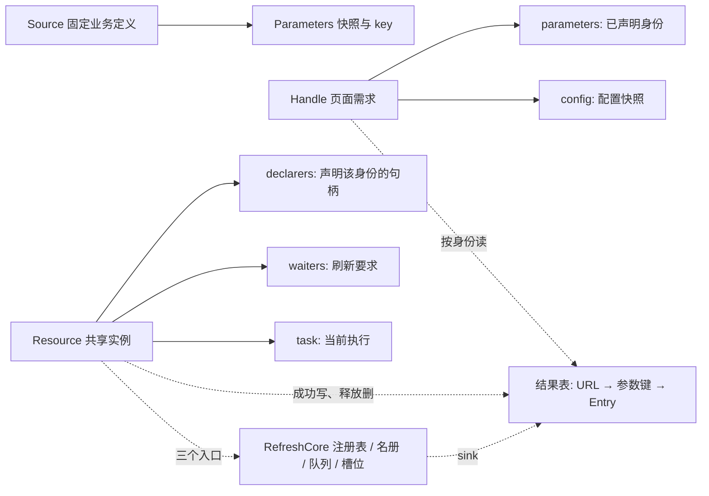

# vue-refresh 设计与实现

本文件维护设计与实现：模块划分、数据模型、参数与结果边界、调度与竞态、生命周期适配、顺序约束。
业务规则、公共 API 契约、验收目录与决策门槛的正式定义在 [统一刷新管理文档](./统一刷新管理.md)。
本版是根契约重写后的实现（见 [ADR.md](./ADR.md) ADR-27）：设计按「一个概念一份事实」重排，
不再是上一版的端口、投影与镜像字段。

**读代码从 §9 开始**：那里有三条进入路线、读之前先记住的四个词、每个符号的一句话作用，以及
「遇到 `if` 时它在防什么」的对照表。`src/core.ts` 的七个 `═══` 分段与 §2 的七个分段一一对应。

## 1. 模块划分与依赖

工程目录：`vue-refresh/`。运行时分层：

```text
public-types.ts            公共类型的唯一代码定义与状态取值常量；不依赖运行时模块
source.ts                  固定资源定义（URL ＋ 参数准入）、提交边界准备与稳定键
core.ts                    跨实例的协调者（注册表、名册、队列与并发、调度）＋ 一个身份的 Resource 类
store.ts                   结果表（Pinia 模块级定义）：URL → 参数键 两级分组，整条替换，随实例释放即删
vue.ts                     组件适配与安装：配置快照、句柄、生命周期、可见性、结果表接线
index.ts                   包入口（三个函数与 6 个公共类型；没有常量对象）
```

依赖方向单向：`public-types` ← `source` ← `core` ← `store` ← `vue` ← `index`。
核心不依赖 Vue 或任何状态库，也不 import 任何 HTTP 客户端：取数用的 axios 实例由 `createRefreshManager` 注入，
`core.ts` 只调它的 `post`。**`store.ts` 是唯一 import Pinia 的模块**，核心只经 `ResultSink` 的三个动作碰结果表。运行期只依赖 `fast-json-stable-stringify`（零依赖，参数键的确定性编码）。这条方向由 `pnpm check:docs` 校验：
**运行期边必须严格向下**，同层或向上的运行期边必须同时在 `check-docs.mjs` 与本节登记，否则直接失败；
类型回边只报告（运行期被擦除）。本版没有需要登记的例外边。

`core.ts` 按职责分成七个分段：状态观测与生命周期、页面操作、观测面、需求关系、后台执行、刷新要求、调度。
全部可变状态分三处：跨实例的挂在协调者上（注册表、名册、队列与并发、唯一唤醒 Timer），
一个身份自己的在 `Resource` 类里（订阅、刷新要求、到期与当前任务），**结果住结果表**（`store.ts`，唯一真值）；
越过实例边界只调核心的三个入口（`enqueue` / `releaseIfUnused` / `writeResult`）。
`vue.ts` 只读公开入口、模块级单例（当前协调者与结果表）与结果表的读出口，`source.ts` 是无状态函数的边界。

## 2. 模块职责

| 文件 | 职责 |
|---|---|
| `public-types.ts` | 公共契约类型（判别联合，没有常量对象）与 `RefreshSource`（成员是方法，靠双变进入框架的擦除视图） |
| `source.ts` | `defineRefresh`（声明点用 `JsonParameters` 约束参数值域）、`Parameters`、`assertJsonValue`（值域检查：对象型限普通对象或数组）、`prepareParameters`（复制 → 值域检查 → 稳定编码 → 执行来源的 `validate`，消费者各拿副本）、定位 `parameterKey`；稳定编码用 `fast-json-stable-stringify` |
| `core.ts` | `RefreshCore`：跨实例的协调者——实例注册表、句柄名册、唯一 Timer 与 FIFO 队列、并发槽、结果表写入端、只读计数投影；`Resource`：一个身份自己的状态与操作（订阅、刷新要求、到期、当前任务、成功与失败结算、回收），越过实例边界只调核心的三个入口（`enqueue` / `releaseIfUnused` / `writeResult`） |
| `store.ts` | 结果表：模块级 `defineStore`，`URL → 参数键 → Entry` 两级分组，`shallowRef` 整条替换；写入端给内核（`write` / `remove` / `list`），读出口给页面（`read`） |
| `vue.ts` | `useRefresh`（配置快照、句柄、指向结果表的 Display、生命周期）、`createRefreshManager`（安装、可见性监听、结果表接线、销毁） |
| `index.ts` | 包导出：三个函数、逐个列出的 6 个公共类型（不用 `export type *`）；工具型别名不导出 |

### 2.1 调用链路

适配层只提交「配置快照」和「参数准备动作」，资格、共享与调度全部在核心，结果写进结果表。一次取数只有这一条路径：

```text
useRefresh（组件 setup）
  ├─ 配置变化 → readConfig → Config 快照（非法为 null）→ RefreshCore.reconcile
  ├─ submit   → prepareParameters → 换身份 → reconcile
  ├─ refresh  → 入口闸（销毁／配置非法／失去存在／无身份）→ 实例 → 刷新要求
  │             → 有当前请求就直接用它的结果，没有才登记一次共享任务
  └─ 生命周期 → onMounted / onActivated / onDeactivated 改写配置快照里的 `active`；onScopeDispose → removeHandle

reconcile  = coordinate ＋ flushSoon（两步必须分开：coordinate 在 flush 里也会跑，那里不能再排 flush）
coordinate → 有身份就登记为**声明者**（挂载期间一直算）；没有资格就不再是读者并结算未完成的刷新要求，但不撤销声明
flush      → 协调句柄 → 一趟：到期入队 ＋ 收齐最早到期时刻 → 按 FIFO 占槽启动 → 安排唯一唤醒 Timer
runTask    → http.post(URL, 参数副本) → 复核任务身份 → Resource.settle：写结果表 ＋ 记结算时刻 ＋ 结算这一批要求 → finally：清计时、释放槽位、补未满足的要求、再调度
expire     → 上限到期：先撤销在册身份 → abort → 按请求失败结算 → 补后继 → 再调度
Resource.settle  → 先写结果表（唯一真值），再结算这一批刷新要求（顺序不能反：结算可能让实例当场释放，而释放会删掉刚写的条目）
```

实例与核心的边界只有两个入口：`enqueue`（排一次请求）、`releaseIfUnused`（没需求了就回收）
（没人要了就注销）。实例持有核心本身，但只用这两个入口；核心其余成员全部 `private`。

需求侧对应：`U01`–`U03` → `submit` 与 `resourceFor`；`U04`–`U06` → `coordinate`、`unsubscribe`、`releaseIfUnused`；
`U07`–`U10` → `Resource.dueAt`、`flush`、`runTask`、`expire`；`U11`–`U13` → `Resource.settle`（写结果表）、`Resource.fail`、`useRefreshStore`；
`U14` → `refresh`、`Resource.clearRequest`、`clearRefreshes`、`Resource.refill`；`U15` → `prepareParameters`、`parameterKey`；`U16`–`U18` → `isolate`、`report`、`dispose`。

## 3. 数据模型

本节是**内部字段、所有权与算法**的唯一维护入口；统一文档只保留对外含义与指针。

### 3.1 对象关系



`Handle.parameters` 是**声明的身份**，`Resource.parameters` 是**实例建立时用的参数**：前者是需求，后者是事实，
不是同一份数据的两个副本。需求关系**只有一处事实**——实例侧 `declarers` 的成员资格（谁声明了这个身份），句柄上没有指向实例的
反向字段，所以不存在「两侧一致」这类需要维护的不变量（ADR-57 删掉了旧的 `Handle.subscription`）。
**声明与资格是两件事**：声明由挂载/卸载与身份变化驱动；资格（配置开启、这一页激活、浏览器可见）只决定要不要取数，
现算、不维护第二份集合（ADR-61）。

`Resource` 是**类**而不是字段集合：一个身份内的转换都定义在它自己身上，核心不替它做决定；两者之间只有
三个入口（`enqueue` / `releaseIfUnused` / `writeResult`）——核心因此不再需要中间接口，实例直接调它（ADR-42、ADR-44）。
**结果不在实例上**：它住结果表，读的人按已声明身份自己取，因此没有「交付」这一步，也没有逐个接收者的副本（ADR-59）。

### 3.2 身份

- URL（`RefreshSource.name`）＋ `Parameters.key` 定位实例；同一个 URL 与同一份参数值就是同一个实例，因此两处各写一份定义也照样合并。实例的生存期由订阅与刷新要求共同决定。
- **没有第二套计数**：任务、结果与刷新要求都不记版本或代次，公开通知也不带「由谁触发」
  （ADR-43 删掉等待者的版本下限、ADR-45 删掉任务版本、ADR-47 删掉声明代次）。

### 3.3 持久字段与唯一所有者

类型形状由代码维护（`src/core.ts`、`src/source.ts`）；本表只维护所有权、初值与释放时机。

| 所有者 | 字段、初值 | 写入与释放 |
|---|---|---|
| Source | `name`（取数 URL，身份的一半）、可选 `validate`；定义时冻结 | `defineRefresh` 唯一建立（URL 必须非空）；所有使用方释放引用后回收 |
| Parameters | `args`、`key`；框架私有，不外发 | 提交边界复制/查值域/编码；外发给消费者（`validate`／每轮请求体）时各复制一份；`display.args` 每次读取再复制一份（它是身份键那份值）；需求与实例释放后回收 |
| Handle | 组 A 端口与配置：`source` / `config=null` / `onError`；组 B 状态：`parameters=null`；组 C 接驳：`cleanup=null` | 三种角色分开看（**本表是这三组角色的权威定义**）：**组 A** 适配层提供、核心只读——`source` / `onError` 创建时给全，`config` 是会变的快照字段（适配层每读到新值就改写，核心只读字段、不调 getter）；**组 B** 核心独占写入，适配层只给初值、从不读；**组 C** `cleanup` 是唯一双向成员：适配层在 watcher 就绪后写一次（晚于 `addHandle` 才产生），核心在 `removeHandle` 读、清、调。**三件事不存字段**：「句柄是否已释放」是 `RefreshCore.handles` 的名册成员资格（§3.7），「声明了哪个身份」是那个实例 `declarers` 的成员资格（§3.5 第 1 条，ADR-57），「有没有资格」由配置快照（`enabled` / `active`）与核心的全局可见性现算（ADR-61）。**`publish` 已随交付路径一并删除**（ADR-59）：框架不再调用任何页面交付回调，页面读的是结果表；`Handle` 的两个类型参数此后只服务于适配层的类型还原 |
| Resource | 类：`core`（只用它三个入口）、`source`、`parameters`、`declarers` 空集合、`waiters` 空集合（`Set<Handle>`）、`settledAt=null`、`task=null` | 首次声明创建；**一个身份只保留一份参数对象**：首次声明采用该句柄声明的那份，后续同键加入者改用实例已持有的那一份（同键等值，是框架内部唯一权威副本；外发给消费者时各复制一份，ADR-52）；`declarers` / `waiters` 都空时由 `releaseIfUnused` 删除注册、结果表条目、排队任务并 abort 在途；创建后参数不被新加入者改写。**一个身份内的转换都是它自己的方法**：`dueAt` / `eligibleEvery` / `isEligible` / `settle` / `fail` / `clearRequest` / `refill`；核心越出实例边界只碰三个字段：`task`（只经 `placeTask`，§3.5 第 4 条）、`declarers` 与 `waiters` 的增删（`coordinate` / `dropDeclaration` / `refresh`） |
| Task | `resource`、`controller` | `enqueue` 创建（同一实例同时至多一个当前任务）；位置（在队／在跑／被弃／已结算）只由 `placeTask` 迁移；`finally` 交还真实槽位，`expire` 提前交还 |
| 结果表（`store.ts`） | `results`：`URL → 参数键 → Entry`；初值 `{}` | 模块级 `defineStore`，一个 Pinia 实例一张表；写入端只由内核用（`writeResult` 写、`releaseIfUnused` 删、`snapshot` 列举），读出口是 `read`；**整条替换**（`shallowRef`，条目当不可变用），实例释放时条目随之消失（A06） |
| RefreshCore | `buckets` / `handles` / `queue` / `running` 空集合；`wakeup=null`；`flushing=false`；`visible=true`；`cleanup=null`；`disposed=false` | 字段全部 `private`：外部只能走命名操作（`addHandle` / `removeHandle` / `setVisible` / `setCleanup` / `reconcile` / `submit` / `refresh` / `snapshot` / `isDisposed` / `dispose`），**另加三个给实例用的入口** `enqueue` / `releaseIfUnused` / `writeResult`，以及给适配层的一个只读判定 `isReader`（都是 public 但不在包契约内，见 ADR-42、ADR-44），其余内部转换全部 `private`；`dispose` 先失效再清理 |
| 配置快照 | `config`（`{ enabled, every, active }`，初值 `null`＝非法） | 由 `vue.ts` 里唯一的配置 watcher 写进 `Handle.config`——两个调用方的 `Ref` 与「这一页是否激活」合成一份快照（单一写入口），随句柄与组件作用域释放。核心只读这个字段，不重新调用业务 getter（ADR-57、ADR-61） |

`snapshot()` 是给演示面板与集成测试的只读计数投影（集合是副本，元素仍是核心对象），
不属于包契约，也不提供改状态的入口。

### 3.4 事件与主流程

| 事件 | 同步转换 | 后续动作与重入边界 |
|---|---|---|
| `submit` 接纳 | 参数通过后整体替换身份 | 参数被拒不改动任何状态；替换时先用旧身份结算刷新要求再退订 |
| 配置变化 | 适配层先写快照（含这一页的 `active`），核心按新资格重算 | `onError` / abort 可能重入；资格判断本身无副作用 |
| 隐藏 / 失活 / 暂停 | 撤销本页未完成的刷新要求（没有回执），失去资格 | 声明不撤销：实例、结果与在途都留着；恢复时读回已有结果 |
| `refresh` 接纳 | 把本句柄加进实例的要数集合，并在没有当前请求时登记一次任务 | 有请求就直接用它的结果；与自动刷新同一条路径；没有回执 |
| 后台成功 | 记结算时刻、把结果写进结果表、结算这一批要求 | 每次外部写入后复核任务归属；**先落结果再结算要求**（结算可能释放实例并删掉刚写的条目）；页面在结果表上按身份自己读 |
| 后台失败 | 记结算时刻、通知仍有效的订阅者、结算全部未完成要求 | 不写结果表（旧结果原样保留），下个周期继续 |
| 上限到期 | 先撤销在册身份再 abort 与结算 | 迟到的结束因身份已失效被完全忽略 |
| 最后一个声明者离开 | 删除注册、结果表条目、排队项并 abort 在途 | 真实结束的任务在自己的 `finally` 里释放槽位 |
| `dispose` | 先置 `disposed`，再释放句柄、实例、队列、Timer 与监听 | 幂等；迟到执行只能清自己的槽位 |

### 3.5 必须成立的不变量

每条都注明**由谁保证**：读代码时按这里的符号名定位，不必先自己反推。

1. 需求关系只有一处事实：句柄在某实例的 `declarers` 里 ⟺ 它声明了该身份。登记只 `add`、撤销只 `delete`，没有第二份需要保持同步的副本；**资格不另存集合**，由 `config.enabled && config.active && RefreshCore.visible` 现算。（`coordinate` 登记、`dropDeclaration` 撤销；ADR-57、ADR-61）
2. 注册表只指向当前生存期的实例；实例被删除后不再被 `flush` 遍历到，也不接受新的订阅。（`resourceFor` 建立、`releaseIfUnused` 删桶）
3. 每次调度都在**有资格的声明者**里现算 `every` 的最小值：没有有资格的声明者就不取数、不安排唤醒。不缓存间隔，也不缓存「下次到期」以外的派生值。（`Resource.dueAt` / `Resource.eligibleEvery`）
4. 一个实例至多一个当前任务；任务的位置（在队／在跑／被弃／已结算）与它是不是「当前执行」只由 `placeTask` 一处改写，`enqueue`、`flush` 起跑、`runTask` 的 `finally`、`expire`、`releaseIfUnused` 都经它；abort 不释放槽位，`expire` 除外。仅有的两处例外是 `dispose` 整表清空 `queue` 与 `flush` 丢弃过期项。（ADR-56）
5. 结果只来自该实例的当前任务的成功；删除后旧请求不得重建该实例。（`runTask` 在 `await` 之后与复制结果之后各复核一次，`Resource.settle` 只被它调用）
6. 结果只由共享路径写入结果表（`Resource.settle` → `RefreshCore.writeResult`），写的是**同一个对象**，读的人拿到它也是同一个对象——要改自己复制；`display.args` 仍然每次读取复制一份。（ADR-59）
7. 当前任务的正常成功/失败在写结果与通知之前更新 `settledAt`；取消与旧任务不更新。（`Resource.settle` 与 `Resource.fail` 的第一行）
8. 订阅成立后 `handle.parameters === resource.parameters`：一个身份只保留一份参数对象，后加入者采用实例已持有的那一份。（`coordinate` 接入时改写句柄字段）
9. `dispose` 后句柄、注册表、队列、结果表条目、Timer 与监听已清；未结束的执行到真实结束才移除。（`dispose` → 逐个 `removeHandle` → `buckets.clear`）
10. 框架上限由「开始执行时登记的一次性计时」表达；到期先撤销在册身份，之后任何迟到的结束都不再写事实。（`runTask` 的 `setTimeout` 与 `expire`）
11. 注销只发生在声明与要求都空时，且空实例再也拿不到新的边：新声明只能落在 `resourceFor` 当前返回的实例上，新要求也一样。（`releaseIfUnused` 是唯一注销点；`coordinate` 与 `refresh` 都经 `resourceFor`）
12. 有资格 ⟹ 配置快照有效：`enabled` 为真、`active` 为真、`every` 是正安全整数，且浏览器可见；因此最小间隔可以直接现算，不必在句柄或实例上另存一份。（`Resource.isEligible`）

### 3.6 刷新要求的唯一更新表

`Resource.waiters` 是 `Set<Handle>`：**一个句柄此刻想要一次取数**。它是一个标志而不是队列——同一个句柄重复
刷新只留一份，而且**没有回执**（成功经结果表、失败只经 `onError`，ADR-46）。

| 事件 / 当前值 | 刷新要求更新 | 结果规则 |
|---|---|---|
| `refresh`（无论实例有没有当前请求） | 把本句柄加进集合 | 有请求就直接用它的结果（排队或已在执行都一样）；没有请求就当场登记一次。不 abort、不追发第二次 |
| 同一实例多个句柄都要取数 | 各自保留 | 同一结果把它们一起满足 |
| 任务成功 | 这一批要求全部移除 | 先把结果写进结果表，再移除这批要求 |
| 任务失败或上限到期 | 该实例**全部**要求移除，并向这些页面各通知一次 | 旧画面保留，订阅与开启意愿保留，下个周期继续 |
| 失去存在 / 卸载 / 销毁 | 撤销该句柄的要求，不通知 | `enabled` 边沿不撤销 |
| 实例再无订阅与要求 | 随最后一个要求移除而销毁实例 | 结果表条目同时删掉：不引入 TTL 或历史缓存 |

一次失败的含义是「这次刷新没拿到新结果」：它撤销该实例**全部**未完成的要求并通知这些页面，因此不会变成自动重试，
与「失败保留画面、下个周期继续」一致（确认人 2026-09-17 裁决「有请求就直接使用，没启动就直接启动」，见 ADR-40）。

**唯一的不变量。** 上表可以由一条不变量表达：**存在未满足刷新要求的实例，必有当前请求，或由本次要求当场登记的那个请求**，
由它的结果满足。唯一的例外是**写结果那一刻**重入登记的要求（例如读结果表的同步 watcher 又 `refresh()`）：
`Resource.settle` 先取这一批要求的快照，重入期间新登记的不在那一批里，只能由 `Resource.refill` 补的后继请求结算（§3.9 第一条）。

### 3.7 派生值：不重复保存

- 任务的位置由 `queue` / `running` 的归属决定；此外另存一个「本实例的当前执行」位 `Resource.task`（它要回答的是「这次迟到的结束还算不算数」，不是位置）。三处只由 `placeTask` 一起迁移（§3.5 第 4 条）。
- 下次到期时刻由 `settledAt ＋ 当前最短 every` 现算，因此改频率立刻生效；`settledAt` 本身是事实（最近一次正常结束）。
- 有效最短间隔由各订阅的 `every` 现算，不缓存。
- 资格由「声明还在」「配置开启且有周期」「这一页激活」「浏览器可见」四组事实现算，不镜像 `enabled`，也不存第二份集合（`Resource.isEligible`）。
- 句柄是否已释放由 `RefreshCore.handles` 的名册成员资格决定，不存字段：`removeHandle` 先出名册再产生外部效果，因此「名册里没有它」就等于「已释放」（ADR-54）。
- 声明到哪个实例由该实例 `declarers` 的成员资格决定，句柄上不存反向字段；`resourceOf` 用句柄声明的身份现查注册表（ADR-57）。
- 不交付「正在刷新」这类实时状态：读出口只给结果与它的产生时间。
- 「我该看到哪一条」不另存：它由句柄当前声明的身份（`source.name` ＋ `parameters.key`）现查结果表得到（ADR-59）。
- 「本页还跟不跟随结果表」不另存：由 `RefreshCore.isReader` 现判——订阅着该身份，或它上面有未撤销的刷新要求（ADR-60）。

### 3.8 状态取值与存放

取值域直接写在 `public-types.ts` 的判别联合里，**没有常量对象**（ADR-51）：调用方比较裸字面量。
结果判别式（`status`）不单独枚举——判别联合本身就是这份枚举；单成员取值不立字段（`submit` 的取消分支不带原因）。

| 状态域 | 取值 | 存放 |
|---|---|---|
| 结果产生时间 | 墙钟 epoch 毫秒（不保证单调） | `Entry.updatedAt` → 读出口把它带进 `RefreshDisplay.updatedAt`；与调度的单调时间 `settledAt` 是两个域 |
| 当前结果 | 每个身份一条 `Entry` / 没有 | **结果表**：`useRefreshStore().results[URL][参数键]`；写由 `Resource.settle`，删由 `releaseIfUnused`，读由页面按身份现查 |
| 刷新要求 | 无 / 待满足（`Set<Handle>`） | `Resource.waiters` |
| 当前声明 | 声明着 / 未声明 | **推导**：句柄是否在该实例的 `declarers` 里；`resourceOf` 按声明身份查注册表（ADR-57） |
| 配置快照 | 有效 / 非法（`null`） | `Handle.config` 字段：适配层写入，核心只读 |
| 组件激活、句柄已释放、浏览器可见、协调者已销毁 | true / false | `Handle.config.active`（并进配置快照，ADR-61）/ **推导**：`RefreshCore.handles` 的名册成员资格 / `RefreshCore.visible` / `RefreshCore.disposed` |
| 待唤醒调度 | 取消句柄 / `null`；已排 flush true / false | `RefreshCore.wakeup` / `flushing` |
| 资源已结算 | 时刻 / `null`（从未结算） | `Resource.settledAt` |
| 当前后台任务 | Task / `null` | `Resource.task` |
| 任务位置 | 在队 / 在跑 / 被弃（在跑但已不是当前执行）/ 已结算 | `RefreshCore.queue` / `running`；「当前执行」另存为 `Resource.task`，三处由 `placeTask` 一起迁移（§3.5 第 4 条） |
| 有效最短间隔 | 正安全整数 | **推导**：现算各订阅的 `every` 最小值 |
| 取数资格 | 是 / 否 | **推导**：声明还在、这一页激活、浏览器可见、配置开启且有周期（`Resource.isEligible`，ADR-61） |

### 3.9 三条路径的走读

这三条是读代码最容易卡住的地方：它们的行为依赖**前提**，而前提不写在函数体里。按符号名定位即可——
本节刻意不写行号，行号会随编辑失效。

**一、写结果时的重入（`Resource.refill` 为什么存在）**
`Resource.settle` **先**取这一批要求的快照，**再**把结果写进结果表、然后逐个结算要求。写结果表会同步触发 Vue 的响应式副作用
（例如页面里 `flush: 'sync'` 的 watcher 读了 `display` 又去 `refresh()`），因此：

- 写结果期间新登记的要求不在这批里（它在快照算完之后才存在），只能由**后继请求**结算；
- `runTask` 的 `finally` 调 `Resource.refill`：仍有未结算要求且没有当前任务时补一次请求；这就是「唯一例外」的落地；
- 顺序固定「先写结果、再结算要求」：要求结算可能让实例当场释放，而释放会删掉刚写进去的条目（A06），
  把两件事倒过来就会出现「实例已经没了、表里却还留着一条」；
- 页面在结果表上读，所以 `settle` 返回时本页 `display` 已经能读到这次的结果。

**二、最后退出与迟到的结束（`releaseIfUnused` 凭什么只判「都空」）**
需求变空只有两个入口：`unsubscribe`（退订）与 `Resource.clearRequest`（要求被撤销或满足），`submit` / 隐藏 / 卸载
都经由它们。两者都调 `releaseIfUnused`，它只判 `declarers` / `waiters` 是否真的都空，然后注销这个键——
**暂停、失活、隐藏都不撤销声明**，所以它们不会走到这一步（这正是「失活恢复直接读回」的原因，ADR-61）。
不再另判「实例是否仍在册」：「都空」已经蕴含「在册」，因为注销是唯一的删除路径，而空实例再也拿不到新的边
（§3.5 第 11 条；ADR-44 删掉那次在册复核的依据）。注销做四件事：删注册、
**删结果表条目**、撤销当前执行、`abort` 在途；在跑的那次标为**被弃**——它仍占着并发槽位，直到迟到的结束自己交还，
而当场交还就会让在途的请求与后来者并发；还在排队的任务同时从 `queue` 移除（`placeTask`，ADR-56）。
`abort` 不承诺底层立刻结束，所以迟到的响应由 `runTask` 的身份复核（`resource.task !== task`）判为无效：
不写结果、不发通知；它的 `finally` 只清自己的计时与槽位。

**三、上限到期（为什么先撤销身份再 abort）**
`runTask` 从真正开始执行时登记一次性计时；到期走 `expire`，顺序是**先** `placeTask(task, 'settled')`
（撤销当前执行并交还槽位），**再** `abort`、`Resource.fail`、`Resource.refill`。这个顺序就是全部要点：`abort` 与失败通知都会同步重入页面代码，
而此刻这次执行的在册身份已被撤销，因此它在 `await` 之后的任何返回都被身份复核判为无效；槽位当场交还，
不等底层结束——所以 `maxConcurrent` 约束的是**在册任务数**，不是底层连接数。

## 4. 参数与结果边界

### 4.1 参数准备与键

固定 Source 绑定取数 URL（`name`）、`P`、`T` 及可选同步 `validate`。`P` 的值域在声明点由 `defineRefresh` 约束为 JSON 值（对象型只能是普通对象或数组，ADR-52），提交边界再由 `assertJsonValue` 运行期兜底：`Date`／`Map`／`Set`／`RegExp`／`ArrayBuffer` 等容器的内容对编码不可见，两个内容不同的参数会塌成同一个身份，故一律拒绝（`Date` 请传 ISO 字符串）。业务字段的合法性仍不归框架——那是调用方与 `validate` 的责任。编码交给 `fast-json-stable-stringify`，标量沿用 JSON 语义：`-0` 与 `0` 同键，`NaN` / `Infinity` 按 `null`，`undefined` 字段按省略；函数与 Proxy 这类复制不了的值由 `structuredClone` 拒绝，循环引用让编码交不出身份。

提交边界**一次**执行；四步各由一个函数负责，没有共享、也没有需要冻结的副作用：

```text
structuredClone → assertJsonValue（值域：对象型限普通对象或数组）
                → stringify（`fast-json-stable-stringify`：键排序 ＋ 数组保序）
                → 可选 Source.validate 一次（拿到自己的副本）→ Parameters
```

对象按键排序编码，数组保持原顺序，因此字段顺序不影响身份、数组顺序影响身份。
**不设内部深度上限**：循环引用让编码交不出身份（`parameterKey` 返回 `null`），与复制失败一样按非法参数处理（`U15`）。
`validate` 每次接纳提交执行一次；轮询、恢复与显式刷新都不执行。
`validate` 返回 Promise 属于契约违约：同步抛错是给调用方的主信号，那个 Promise 也被观察掉，不产生未处理拒绝。

### 4.2 观测面

`snapshot()` 是给演示面板、基准脚本与集成测试看的**只读计数投影**（不属于包契约）：句柄名册、实例数组、
**结果表的一份扁平副本**（`results`：`url` / `key` / `entry` 三列）、排队与在途任务、唯一唤醒 Timer 与「已排 flush」的布尔值。
集合是副本、元素仍是核心对象（比较身份是这些断言的要点），因此它是观察面而不是安全边界。

结果那一项带 `url` ＋ `key`，所以两个 URL 用同一个参数键不会互相覆盖（ADR-46 删掉的是只按参数键拍平的字典）。
包本身仍然不提供「按身份读」的公开入口：**页面侧读的是自己的 `display`**（一个指向结果表的只读视图），
要用在别处就在页面自己的适配层里读它，框架不做第二个出口。

### 4.3 数据所有权

- DTO 业务校验由取数所在的传输侧负责（本仓示例是 `demoHttp`，接入方通常是 axios 响应拦截器）。框架拿到的是
  `response.data`，只做结果边界检查（拒绝 `undefined`、原生复制），不做形状复核——因此畸形响应在框架看来是
  一次**成功**：它会覆盖旧结果。要不要挡住它，是传输侧的决定。
- 框架拒绝 `undefined` 并执行 `structuredClone`；不做原型白名单、自有描述符、循环或复制后形状复核。
- 原生支持的 `Date` / `Map` / 循环等可被复制，**不表示**框架验证了业务合法性；不支持的值由原生复制抛错，
  沿用共享请求失败处理；`null` 是有效结果。
- **结果的读出口与参数不同**（ADR-59）：结果只复制一次（入站 `copyResult` 建立框架私有所有权），
  之后**所有人读到的都是同一个对象**——要改自己复制，只读视图由 `ReadonlySnapshot` 在编译期约束；
  不冻结业务原对象，也不用 JSON 来回 `parse`。代价说清楚：一个页面就地改它，其他页面与下一次读都跟着变。
- **参数仍是每个消费者各复制一份**（`structuredClone`，ADR-52）：提交边界复制一份作为框架私有权威副本，
  每一轮请求体各拿一份，`display.args` 每次读取也复制一份，因此页面写自己的 `display.args` 改不到
  下一轮请求的参数或身份键所描述的值。**隔离不靠冻结**：`Object.freeze` 冻的是
  属性描述符，而 `Map.set` / `Set.add` / `Date.setTime` 写的是内部槽，规范上冻不住——既然私有副本不外发，
  就不需要「冻得住」这个假设。

### 4.4 复杂度

- 参数提交：复制一次、值域遍历一次、编码遍历一次、可选业务校验一次（另复制一份给 `validate`）。按值展开参数规模记 K，成本 `O(K)`；每次读 `display` 再复制一次参数，k 页即 `O(kK)`。
- DTO 入站复制 `O(D)`；结果不再逐页复制，读的人拿到同一份（ADR-59），因此没有 `O(kD)` 这一项；结果是整条替换，不维护增量结构。
- 调度按实例与订阅扫描；FIFO 出队按任务数。
- 规模结论见[统一文档](./统一刷新管理.md) §5 G04。

## 5. 调度、并发与竞态

### 5.1 一次 flush

```text
清本轮标记并取消旧 Timer
→ 协调当前全部句柄
→ 一趟遍历：到期实例入队，同时收齐其余实例的最早到期时刻
→ 按 FIFO 和可用槽位启动
→ 队列已空且仍有到期项时安排唯一唤醒 Timer
```

**这一轮只读一次时钟。** `Resource.dueAt` 接收这个读数，不在函数内再读一次：真实时钟在一次 flush 内会前进，
两次读数会把「从未结算的实例立即到期」变成「尚未到期」，于是首次入队被推迟到一个 0ms Timer。
新追加的任务留到下一次 flush；满槽时不自旋，等到任务真实结束或上限到期后继续；间隔超过平台 Timer 范围时分段等待。

### 5.2 并发与上限

- `queue` / `running` 是执行位置的唯一事实：`running` 统计真实尚未结束的任务，也就是并发槽。
- 显式刷新与自动刷新共用队列与 `maxConcurrent`；满槽排队，不绕过上限。
- **框架上限**从任务真正开始执行起算（排队不计入），数值 `10000` 毫秒由确认人给出（ADR-20）。
  到期按共享请求失败结算并立即出册，因此挂死的传输、忘了拒绝的适配器、把长连接当一次取数的封装
  都不能让槽位永久被占。abort 会取消该计时。
- 出册后这次执行迟到的结束在任务身份复核处被判无效：不写结果、不发通知。
- 因此 `maxConcurrent` 约束的是**在册任务数**：被上限结算的任务不再计入，其底层请求可能仍未结束。
  上限不代替适配器自己的业务超时——那是调用方的事实，框架不猜。abort 不承诺服务端立即停止。

### 5.3 结果有效性

需要复核身份的边界是：`await` 之后、复制结果之后、写结果之前（写进结果表这一刻必须仍是在册的当前执行）。
普通只读判断不触发外部效果。后台成功只做两件事：把结果写进结果表、结算这一批刷新要求；谁在读、读几次由读者决定。
历史结果不要求原任务仍存活；它随实例释放而消失（A06），因此「回来就有」只在实例仍活着时成立。

## 6. 生命周期与 Vue 适配

### 6.1 配置快照

- watch 源只读 `options.enabled.value` 与 `options.every.value`；两项都是必填的 `Ref`，改值即改配置。
- 任一项读不出或值非法时快照为 `null`：不取数、不自动刷新、不通知，修正后按当前资格恢复（ADR-51）。
- 读不到的开关绝不推断成 `false`：页面可以用 `computed` 表达暂态条件（例如
  `enabled: computed(() => store.ready && store.on)`），框架下一轮再读。
- 核心只读这份快照，不重新调用业务 getter；快照不是可独立修改的第二份开启意愿。
- `readConfig` 是 watch 的取值函数，因此必须同步、纯、不抛：整体只兜一层 `catch`（任一项读不出即返回 `null`）。
  **边界**：某一项 getter 抛错时，它之后的项当轮不再被读取，Vue 也会清掉当轮未重新收集的依赖，
  恢复要靠抛错那一项自身的变化。常见的「配置非法」是值不对（`undefined` / 非布尔）而不是抛错，
  那种情况三项都会读完、依赖齐全；要让三项在任何情况下都各自完成依赖收集，就得逐项捕错（旧实现的写法，多 4 行）。
- `every` 只接受正安全整数毫秒，不转换、不取整；只在 `enabled` 为真时必需，省略而开启为真按配置非法拒绝。

### 6.2 生命周期

- `mounted` / `activated` / `deactivated` 只改写配置快照里的一项 `active`（唯一写入口是那个 `flush: 'sync'` 的 watcher）；三者可能交叠（KeepAlive），因此写入必须幂等。
- 浏览器隐藏只是让所有页面失去资格（不再取数、画面冻结），声明与结果都留着；恢复可见后按到期继续。
- 暂停后仍允许显式 `refresh`；`enabled` 边沿只改变资格，不撤销声明、不结算已发起的刷新要求。
- 生命周期取消不报请求失败、不修改开启意愿。
- 重新显示时：实例仍在则按已声明的身份从结果表读回已有结果并按间隔调度；已销毁则重建并首查。
- 自定义页签由调用方提供响应式可见条件；初始隐藏时不请求。

### 6.3 安装与单例

- 安装顺序固定为「先检查后修改」：被拒的安装不破坏已有合法绑定，也不新增监听或请求。
- 每个协调者只注册一个 `visibilitychange` 监听。
- 当前协调者放在模块级变量里：安装时若现有实例还活着就拒绝，已销毁则直接替换（HMR、会话切换），
  组件适配不经过 `provide` / `inject`。
- `dispose` 先失效再清理自身监听与资源；卸载钩子调用 `dispose`。

### 6.4 通知隔离

- `onError` 同步执行，返回的 Promise 拒绝立即观察但不等待，不阻塞其他接收者。
- 框架**调用**的 `onError` / `cleanup` 抛错或返回拒绝的 Promise 都只被吞掉，
  不改变已定结果、订阅与调度；框架自身不写诊断日志。（交付回调已随结果表一并删除，ADR-59）
- 隔离面恰好是这三类回调：传输拿到的 `AbortSignal` 上的监听器由宿主在 `abort()` 时同步调用，
  它们的抛错由宿主上报，框架 catch 不到，因此不在承诺内。
- 后台失败保留需求与开启意愿，旧画面不变，下个周期继续；框架不改写调用方的 `enabled`。

## 7. 顺序约束

1. **先建立新身份，再作废旧关系。** 新任务与新声明必须先就位，再 abort 旧执行。
2. **先让内部关系完整失效，再产生外部效果。** 退订先清句柄字段与集合成员，再删结果，最后 abort。
3. **外部效果之后复核身份。** `await`、复制结果、写进结果表之前都要重新判断归属。
4. **旧清理只清自己。** 旧执行的 `finally` 只移除自己的槽位成员。
5. **资格判断无副作用。** `coordinate`、`Resource.dueAt` 与 `Resource.isEligible` 只读事实。
6. **槽位只在两种情况下变化。** 真实结束释放自己的槽位；上限到期先撤销在册身份再出册。
7. **配置只读快照。** 适配层的同步 watch 是唯一写入者。

## 8. 验证

`pnpm typecheck` → `pnpm test` → `pnpm check:docs` → `pnpm build` → `pnpm build:demo` → `pnpm test:browser`；
`pnpm complexity` 输出每文件与函数的行数、结构分支、圈复杂度和嵌套深度。
实际执行环境与已通过项见 [README](./README.md)「实际验证与边界」。
测试预期属于契约，修正测试前先确认契约。

## 9. 读这个库的顺序

本节是读代码的入口，替代「先通读注释」：**代码里的注释只写「做什么」，理由在本文与 [ADR.md](./ADR.md) 里。**
先按 §9.1 选一个进入点，记住 §9.2 的四个词，用 §9.3 查符号，遇到 `if` 用 §9.4 对照。

### 9.1 三条进入路线

| 你想弄清 | 从这里开始 | 接着读 |
|---|---|---|
| 一次取数怎么走完 | `src/index.ts`（三个导出）→ `vue.ts` 的 `useRefresh` | §2.1 的链路，再看 `RefreshCore.submit` → `reconcile` → `flush` → `runTask` → `Resource.settle`（写结果表） |
| 一个页面的需求怎么变成共享实例 | `RefreshCore.submit` → `RefreshCore.resourceFor` → `RefreshCore.coordinate` | §3.1 对象关系、§3.3 所有权表、§3.5 第 8／11 条 |
| 隐藏、卸载、销毁之后还剩什么 | `RefreshCore.setVisible` / `RefreshCore.removeHandle` / `RefreshCore.dispose` | §3.6 更新表、§3.9 第一／二条、§3.5 第 9 条 |

### 9.2 读代码前先记住的七个词

| 词 | 一句话含义 | 谁保证它 |
|---|---|---|
| 在册 | 这个句柄还在名册里；**不在册就等于已释放** | `addHandle` / `removeHandle`（§3.7） |
| 声明 | 这个句柄声明了对某身份的需求；挂载期间一直算，暂停/失活/隐藏都不撤销 | `coordinate` 登记、`dropDeclaration` 撤销（§3.5 第 1 条） |
| 取数资格 | 声明还在 ＋ 这一页激活 ＋ 浏览器可见 ＋ 配置开启且有周期，四组缺一不可；**只决定要不要取数** | `Resource.isEligible`（§3.5 第 12 条） |
| 当前任务 | 一个实例至多一个任务，它至多在队列或在执行之一 | `placeTask`（`enqueue` / `flush` 起跑 / `runTask` 的 `finally` / `expire` / `releaseIfUnused` 都经它） |
| 刷新要求 | 这个句柄此刻想要一次取数；是**标志不是队列**，没有回执 | `Resource.waiters`；`refresh` 登记、`Resource.clearRequest` 撤销 |
| 结果表 | 结果的唯一真值：`URL → 参数键 → Entry`；页面按**已声明身份**读它，读到的就是那一份对象 | `useRefreshStore`（`store.ts`）：`Resource.settle` 写、`releaseIfUnused` 删、`display` 读 |
| 读者 | 本页此刻**有资格**（声明着它、开启、激活、浏览器可见），或它上面有未撤销的刷新要求；不是读者就冻结画面 | `RefreshCore.isReader`（`display` 的更新闸门） |

### 9.3 每个符号做什么

| 符号 | 做什么 |
|---|---|
| `defineRefresh` | 声明一种固定业务资源：URL（身份的一半，必须非空）＋ 可选参数准入规则；建议放应用级常量 |
| `useRefresh` | 组件侧入口：登记本页需求句柄，跟踪配置与生命周期，返回指向结果表的只读显示面与两个动作 |
| `createRefreshManager` | 创建应用级协调者：接结果表（`pinia`）、取数实例（`axios`）与并发上限；`install` 再接可见性监听与卸载释放 |
| `RefreshCore.isDisposed` | 协调者是否已销毁；存活状态的唯一公开出口 |
| `RefreshCore.setVisible` | 浏览器可见性变化：隐藏时当场退订并立即结算 |
| `RefreshCore.setCleanup` | 登记框架自身的释放回调（应用卸载时移除可见性监听），至多一个 |
| `RefreshCore.addHandle` / `RefreshCore.removeHandle` | 登记一个句柄并协调它／释放一个句柄（结算要求、退订、停止接纳） |
| `RefreshCore.isReader` | 这个句柄此刻算不算该身份的读者（有资格的声明，或有未撤销的要求）；视图据此跟随或冻结 |
| `RefreshCore.reconcile` | 配置或生命周期变化后的唯一入口：先协调关系，再安排一次合并调度 |
| `RefreshCore.submit` | 声明或更新身份；相同参数值幂等，参数准备在身份被接纳之后才执行 |
| `RefreshCore.refresh` | 登记一次要数；有当前请求就直接用它的结果，不回执 |
| `RefreshCore.snapshot` | 只读计数投影，给演示面板、基准脚本与测试看；不属于包契约 |
| `RefreshCore.dispose` | 销毁：幂等、不可复用 |
| `RefreshCore.enqueue` / `releaseIfUnused` / `writeResult` | 给实例用的三个跨实例入口（排队／回收／把结果写进结果表）；public 但不在包契约内 |
| `RefreshCore.placeTask`（私有） | 任务位置的唯一迁移点：在队／在跑／被弃／已结算，`Resource.task` 与 `queue`／`running` 一起改 |
| `Resource.dueAt` / `eligibleEvery` / `isEligible` | 下次到期时刻／有资格声明者里的最小间隔／单个声明者有没有资格；都现算，不缓存 |
| `Resource.settle` / `fail` | 一次请求的两种结局：成功（写结果表 ＋ 结算要求），或失败结算（只通知，不写表） |
| `RefreshCore.isReader` | 本页此刻算不算该身份的读者（订阅 ∪ 未撤销要求）；视图据此决定跟随还是冻结 |
| `Resource.clearRequest` / `refill` | 撤销一条要数／任务结束后补一次后继请求 |
| `prepareParameters` | 提交边界只执行一次：复制 → 值域检查 → 编码身份键 → 可选业务校验 |
| `useRefreshStore` | 结果表本身：`write` / `remove` / `list`（内核写入端）与 `read`（页面读出口）；模块级定义，一个 Pinia 一张表 |

### 9.4 遇到 `if` 时按什么读

`core.ts` 里的守卫不是重复代码。它们只防三件事，读之前先认出是哪一件：

| 防什么 | 长相 | 作用 |
|---|---|---|
| 已销毁或不在册 | 入口第一行的 `this.disposed` 检查，以及 `!this.handles.has(handle)` | 不在册的句柄按已释放处理，后续写入一概不发生 |
| 任务已被替换 | `resource.task !== task`（也有 `=== task` 的反面） | 每个 `await` 与每次外部效果之后：丢弃迟到结束，不写结果、不发通知；`placeTask` 撤销当前执行时同样认人（`expire` 交还槽位后可能已经登记了后继任务） |
| 回调里同步重入 | `!this.core.isReader(handle)` | 每个**通知点**之前（`fail` 的通知循环）：前一个页面的 `onError` 可能已经改身份、换身份或卸载，因此每次通知前重新判一次读者身份 |

**这三组守卫是承重的，不是冗余。** 以 `RefreshCore.submit` 为例：入口先查一次在册，然后调 `prepare()`——
那是页面代码（`prepareParameters` 会调 `validate`），可能同步重入、把这个句柄卸载掉；它随后走的
`reconcile` → `coordinate` 里还有第二道同样的查询，防的正是这次重入。两处看起来一样，各自防的东西不同
（这次复核记在 ADR-55、ADR-61）。
把这三组收成具名判定（让每个 `if` 读起来是一句话）是**尚未裁决**的下一步。
