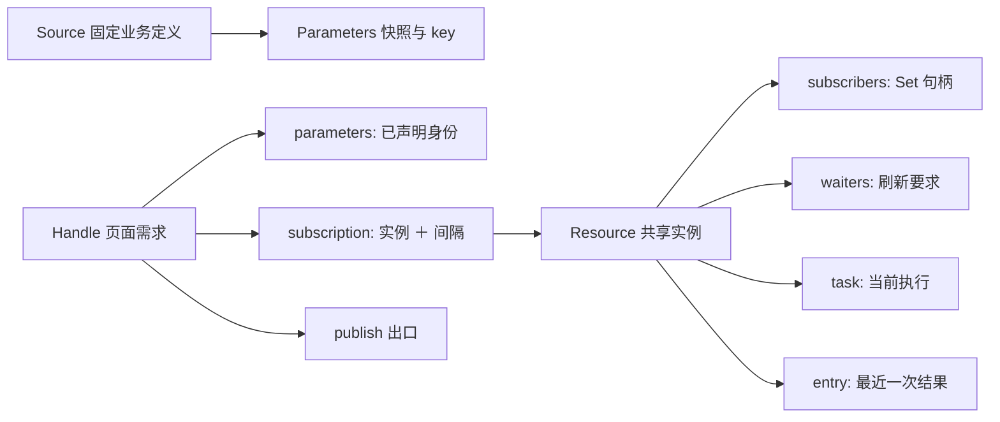

# vue-refresh 设计与实现

本文件维护设计与实现：模块划分、数据模型、参数与结果边界、调度与竞态、生命周期适配、顺序约束。
业务规则、公共 API 契约、验收目录与决策门槛的正式定义在 [统一刷新管理文档](./统一刷新管理.md)。
本版是根契约重写后的实现（见 [ADR.md](./ADR.md) ADR-27）：设计按「一个概念一份事实」重排，
不再是上一版的端口、投影与镜像字段。

## 1. 模块划分与依赖

工程目录：`vue-refresh/`。运行时分层：

```text
public-types.ts            公共类型的唯一代码定义与状态取值常量；不依赖运行时模块
source.ts                  固定资源定义、提交边界准备与稳定键、只读定位
core.ts                    全部运行时状态：共享实例、订阅、刷新要求、调度、交付与失败
vue.ts                     组件适配与安装：配置快照、句柄、生命周期、可见性、只读入口
index.ts                   包入口（三个函数、三个状态常量对象与 8 个公共类型）
```

依赖方向单向：`public-types` ← `source` ← `core` ← `vue` ← `index`。
核心不依赖 Vue 或任何状态库，也没有第三方运行时依赖。这条方向由 `pnpm check:docs` 校验：
**运行期边必须严格向下**，同层或向上的运行期边必须同时在 `check-docs.mjs` 与本节登记，否则直接失败；
类型回边只报告（运行期被擦除）。本版没有需要登记的例外边。

`core.ts` 按职责分成七个分段：状态观测与生命周期、页面操作、只读定位与观测面、需求关系、后台执行、刷新要求、调度。
全部可变状态都在 `core.ts`；`vue.ts` 只用公开入口与注入槽位，`source.ts` 是无状态函数的边界。

## 2. 模块职责

| 文件 | 职责 |
|---|---|
| `public-types.ts` | 公共契约类型、三个状态取值常量对象（`RequestOrigin` / `ErrorOrigin` / `CancelReason`）与品牌化的 `RefreshSource` |
| `source.ts` | `defineRefresh`、`Parameters` 与 `SourceRuntime`、`prepareParameters`（复制 → 守卫/冻结/稳定编码 → 可选校验）、只读定位 `parameterKey` |
| `core.ts` | `RefreshCore`：实例注册表、句柄关系、刷新要求、唯一 Timer 与 FIFO 队列、并发槽、交付与失败、只读计数投影 |
| `vue.ts` | `useRefresh`（配置快照、句柄、Display、生命周期）、`createRefreshManager`（安装、可见性监听、只读入口、销毁）、注入槽位 |
| `index.ts` | 包导出：三个函数、三个状态常量对象、逐个列出的 8 个公共类型（不用 `export type *`）；工具型别名不导出 |

### 2.1 调用链路

适配层只提交「配置快照」和「参数准备动作」，资格、共享、调度与交付全部在核心。一次取数与交付只有这一条路径：

```text
useRefresh（组件 setup）
  ├─ 配置变化 → readConfig → Config 快照（非法为 null）→ RefreshCore.reconcile
  ├─ submit   → 推进声明代次 → prepareParameters → 换身份 → reconcile
  ├─ refresh  → 入口闸（销毁／配置非法／失去存在／无身份）→ 实例 → 刷新要求（版本下限）
  │             → 没有当前任务就登记一次共享任务
  └─ 生命周期 → onMounted / onActivated → activate；onDeactivated → deactivate；onScopeDispose → removeHandle

reconcile  = coordinate ＋ flushSoon（两步必须分开：coordinate 在 flush 里也会跑，那里不能再排 flush）
coordinate → 资格成立则接入实例或更新间隔，否则退订（失去存在时先结算未完成的刷新要求）
flush      → 协调句柄 → 一趟：到期入队 ＋ 收齐最早到期时刻 → 按 FIFO 占槽启动 → 安排唯一唤醒 Timer
runTask    → source.load → 复核任务身份 → 记结果与结算时刻 → publish → finally：清计时、释放槽位、补后继、再调度
expire     → 上限到期：先撤销在册身份 → abort → 按请求失败结算 → 补后继 → 再调度
publish    → 有效订阅 ∪ 满足门槛的刷新要求，各一份独立副本 → 结算刷新要求（结算在交付之后）
readSnapshot → 算键 → 查实例 → 独立副本（不建实例、不保活）
```

需求侧对应：`U01`–`U03` → `submit` 与 `resourceFor`；`U04`–`U06` → `coordinate`、`unsubscribe`、`releaseIfUnused`；
`U07`–`U10` → `dueAt`、`flush`、`runTask`、`expire`；`U11`–`U13` → `publish`、`fail`、`deliverTo`；
`U14` → `refresh`、`floor`、`refill`、`settleWaiter`；`U15` → `readSnapshot`、`parameterKey`；`U16`–`U18` → `isolate`、`report`、`nextSequence`、`dispose`。

## 3. 数据模型

本节是**内部字段、所有权与算法**的唯一维护入口；统一文档只保留对外含义与指针。

### 3.1 对象关系



`Handle.parameters` 是**声明的身份**，`Resource.parameters` 是**实例建立时用的参数**：前者是需求，后者是事实，
不是同一份数据的两个副本。`subscription` 只出现在句柄上，实例侧持有的是同一批句柄本身——
没有第二个对象描述同一条关系，因此不存在「两侧一致」这类需要维护的不变量。

### 3.2 身份与版本域

- Source 对象身份 ＋ `Parameters.key` 定位实例；实例的生存期由订阅与刷新要求共同决定。
- `Handle.operationId` 是声明代次，只用于错误的归属；`Resource.issued` 是**最后一个已分配**的任务版本，
  `Task.version` 与 `Waiter.min` 处于同一实例的版本域。
- 任务版本只在同一实例内比较；声明代次不能替代任务版本，刷新要求与页面身份也不共用计数。
- 序号域足够大（安全整数上界，单页每毫秒一次提交也要约 28.5 万年才到达）：到达上界后停在原地，
  不销毁协调者、不抛错，也不给调用方第三种结果（ADR-23 的结论在 `nextSequence` 上保留）。

### 3.3 持久字段与唯一所有者

类型形状由代码维护（`src/core.ts`、`src/source.ts`）；本表只维护所有权、初值与释放时机。

| 所有者 | 字段、初值 | 写入与释放 |
|---|---|---|
| Source | `load`、可选 `validate`；定义时冻结 | `defineRefresh` 唯一建立；所有使用方释放引用后回收 |
| Parameters | `args`、`key`；准备成功后只读 | 提交边界复制/冻结/编码；需求与实例释放后回收 |
| Handle | `operationId=0`、`parameters=null`、`subscription=null`、`cleanup=null`、`active=false`、`disposed=false` | 全部写入都在 `core.ts` 内：声明与关系由核心写，生命周期走 `activate` / `deactivate`，`cleanup` 走句柄字段；适配层只读它们。`source` / `config` / `publish` / `onError` 是固定端口；`publish` 声明为**方法**，方法参数双变，具体 `RefreshDisplay<P, T>` 因此可以直接进入擦除后的注册表槽位（ADR-24） |
| Resource | `source`、`parameters`、`subscribers` 空集合、`waiters` 空集合、`entry=null`、`settledAt=null`、`issued=0`、`task=null` | 首次接入或刷新要求创建；**一个身份只保留一份参数对象**：首次接入采用该句柄声明的那份，后续同键加入者改用实例已持有的那一份（同键等值且已冻结，`deliverTo` 与 `load` 也只用这一份）；`subscribers` / `waiters` 都空时由 `releaseIfUnused` 删除注册、结果、排队任务并 abort 在途；创建后参数不被新加入者改写 |
| Task | `resource`、`version`、`controller` | `enqueue` 创建（同一实例同时至多一个当前任务）；执行位置由 `queue` / `running` 决定；`finally` 释放真实槽位，`expire` 提前出册 |
| Waiter | `handle`、`min`、`settle` | `refresh` 创建并挂到实例的 `waiters` 上；原生 Promise 首次结算生效；成功后按门槛结算，失败/失去存在/销毁时结算 |
| Entry | `version`、`data`、`updatedAt` | 当前有效成功时整条替换，时间取提交那一刻的墙钟；实例销毁时随实例消失 |
| RefreshCore | `buckets` / `handles` / `queue` / `running` 空集合；`wakeup=null`；`flushing=false`；`visible=true`；`cleanup=null`；`disposed=false` | **全部 `private`**：外部只能走命名操作（`addHandle` / `removeHandle` / `activate` / `deactivate` / `setVisible` / `setCleanup` / `reconcile` / `submit` / `refresh` / `readSnapshot` / `snapshot` / `isDisposed` / `dispose`），`dispose` 先失效再清理 |
| 配置快照与通知状态 | `snapshot`（初值非法）、`reported` | 名字见 `vue.ts`；只在适配闭包内，随组件作用域释放。快照同时是 `Handle.config` 返回的唯一事实，核心不重新调用 getter |

`snapshot()` 是给演示面板与集成测试的只读计数投影（集合是副本，元素仍是核心对象），
不属于包契约，也不提供改状态的入口。

### 3.4 事件与主流程

| 事件 | 同步转换 | 后续动作与重入边界 |
|---|---|---|
| `submit` 接纳 | 推进 `operationId`；参数通过后整体替换身份 | 参数被拒不改动任何状态；替换时先用旧身份结算刷新要求再退订 |
| 配置变化 | 适配层先写快照，核心按资格接入或退订 | `onError` / abort 可能重入；资格判断本身无副作用 |
| 隐藏 / 失活 | 结算本页未完成的刷新要求为 `unavailable`，退订 | 取消立即结算，不等底层结束 |
| `refresh` 接纳 | 登记刷新要求（版本下限）并在没有当前任务时登记一次任务 | 与自动刷新同一条路径；不复制第二份 DTO |
| 后台成功 | 记结算时刻与结果、逐页独立副本、结算满足门槛的要求 | 每次外部写入后复核任务归属；结算在交付之后 |
| 后台失败 | 记结算时刻、通知仍有效的订阅者、结算全部未完成要求 | 保留画面与需求，下个周期继续 |
| 上限到期 | 先撤销在册身份再 abort 与结算 | 迟到的结束因身份已失效被完全忽略 |
| 最后退出 | 删除注册、结果、排队项并 abort 在途 | 真实结束的任务在自己的 `finally` 里释放槽位 |
| `dispose` | 先置 `disposed`，再释放句柄、实例、队列、Timer 与监听 | 幂等；迟到执行只能清自己的槽位 |

### 3.5 必须成立的不变量

1. `subscription` 非空时，`handle.subscription.resource.subscribers` 一定含有该句柄；退订先把句柄字段清空再删集合成员。
2. 注册表只指向当前生存期的实例；实例被删除后不再被 `flush` 遍历到，也不接受新的订阅。
3. 每次调度都用当前 `subscription.every` 的最小值现算到期，不缓存「下次到期」以外的派生值。
4. 一个实例至多一个当前任务；任务至多在 `queue` / `running` 之一；abort 不释放槽位，`expire` 除外。
5. 结果只来自该实例的当前任务的成功；删除后旧请求不得重建该实例。
6. 只有共享路径写结果与交付 `display`；DTO 与结果之间无可变别名，每个接收者各一份副本。
7. 当前任务的正常成功/失败在交付之前更新 `settledAt`；取消与旧任务不更新。
8. `dispose` 后句柄、注册表、队列、结果、Timer 与监听已清；未结束的执行到真实结束才移除。
9. 框架上限由「开始执行时登记的一次性计时」表达；到期先撤销在册身份，之后任何迟到的结束都不再写事实。

### 3.6 刷新要求的唯一更新表

`Waiter` 是 `{handle, min, settle}`，只代表一次显式刷新尚未满足；它不是句柄的第二个状态，也不是订阅的一部分。
`min` 只比较客户端任务版本，不承诺服务端数据强一致。

| 事件 / 当前值 | 刷新要求更新 | 结果与交付规则 |
|---|---|---|
| `refresh` 且实例没有当前任务 | 新建要求，`min = issued`；登记一次任务 | 任务启动即满足「动作之后启动」 |
| `refresh` 且当前任务在排队 | 新建要求，`min = 该任务的版本` | 不追加请求：排队任务已经算「动作之后启动」 |
| `refresh` 且当前任务已启动 | 新建要求，`min = 该任务版本 + 1` | 不 abort 在途任务；它结束后由 `refill` 补一次后继请求 |
| 同一实例多个未满足要求 | 各自保留，携带相同或不同的 `min` | 任务成功时结算所有 `min ≤ 本次版本` 的要求 |
| 任务成功 | 满足门槛的要求结算 `success` 并移除 | 先交付（含仅由刷新要求产生的接收者），再结算 |
| 任务失败或上限到期 | 该实例**全部**未结算要求结算 `error` / `request` 并移除 | 旧画面保留，订阅与开启意愿保留，下个周期继续 |
| 失去存在 / 卸载 / 销毁 | 该句柄的要求结算 `cancelled`；`enabled` 边沿不结算 | 取消立即结算 |
| 实例再无订阅与要求 | 随最后一个要求移除而销毁实例 | 不引入 TTL 或历史缓存 |

失败结算的是该实例全部未结算要求，包括 `min` 高于本次失败任务的那一个：一次失败的含义是
「这次刷新没拿到新结果」，若把更高的下限留在集合里，`refill` 会立刻补一次后继请求，等于「失败即自动重试」，
与「失败保留画面、下个周期继续」冲突。`success` 则相反，只结算 `min ≤ 本次版本` 的要求。

**唯一的不变量。** 上表可以由一条不变量表达：**存在未满足刷新要求的实例，必有一个版本不低于这些要求下限的任务**
（没有当前任务就登记一个；排队中的任务若版本已达下限即已满足），任务结束时结算。

### 3.7 派生值：不重复保存

- 任务的执行阶段由 `queue` / `running` 的归属决定，不存字段。
- 下次到期时刻由 `settledAt ＋ 当前最短 every` 现算，因此改频率立刻生效；`settledAt` 本身是事实（最近一次正常结束）。
- 有效最短间隔由各订阅的 `every` 现算，不缓存。
- 刷新要求的版本下限由「当前任务是否存在、是否已在执行」现算。
- 资格由存活、已声明身份、生命周期与可见性、配置快照四组事实决定，不镜像 `enabled`。
- 不交付「正在刷新」这类实时状态：交付面只给结果与它的产生时间。

### 3.8 状态取值与存放

状态字面量的唯一来源是三个公开常量对象：`RequestOrigin`、`ErrorOrigin`、`CancelReason`（`public-types.ts`）。
子集类型（`SubmitResult` 的取消原因、`RefreshResult` 的错误来源）在类型层写成可达成员的联合，
不新增第二个常量对象，也不手写差集求补。结果判别式（`status`）不单独枚举——判别联合本身就是这份枚举。

| 状态域 | 取值 | 存放 |
|---|---|---|
| 请求来源 | `refresh` / `background` | `RefreshDisplay.origin`，每次发布的事实（按接收者判定） |
| 结果产生时间 | 墙钟 epoch 毫秒（不保证单调） | `Entry.updatedAt` → 交付时进入 `RefreshDisplay.updatedAt`；与调度的单调时间 `settledAt` 是两个域 |
| 错误来源 | `request` / `validation` / `configuration` | `RefreshError.origin`；与请求来源是两个语义域 |
| 刷新失败来源 | `request` / `configuration` | `RefreshResult` 的 error 分支 |
| 取消原因 | `superseded` / `unavailable` / `disposed` | `RefreshResult` 的 cancelled 分支 |
| submit 取消原因 | 可达子集：`superseded` / `disposed` | `SubmitResult` 的 cancelled 分支 |
| 刷新要求 | 无 / 待满足（版本下限 `min`） | `Resource.waiters` |
| 当前订阅 | 实例 ＋ 间隔 / `null` | `Handle.subscription` |
| 配置快照 | 有效 / 非法（`null`） | 适配闭包 → `Handle.config` |
| 组件激活、句柄已释放、浏览器可见、协调者已销毁 | true / false | `Handle.active` / `Handle.disposed` / `RefreshCore.visible` / `RefreshCore.disposed` |
| 待唤醒调度 | 取消句柄 / `null`；已排 flush true / false | `RefreshCore.wakeup` / `flushing` |
| 资源已结算 | 时刻 / `null`（从未结算） | `Resource.settledAt` |
| 当前后台任务 | Task / `null` | `Resource.task` |
| 任务执行位置 | 排队 / 执行中 / 都不是 | **推导**：`queue` / `running` 的归属 |
| 有效最短间隔 | 正安全整数 | **推导**：现算各订阅的 `every` 最小值 |
| 订阅资格 | 是 / 否 | **推导**：存活、已声明身份、环境允许、配置开启四组事实 |

## 4. 参数与结果边界

### 4.1 参数准备与键

固定 Source 绑定 `P`、`T`、`load` 及可选同步 `validate`。输入是应用构造的普通 JSON 记录：
**根必须是普通记录**（数组、`null`、原始值都按非法参数拒绝），嵌套值为 `null` / `boolean` / `string` / 有限 number（不含 `-0`）/ 普通记录 / 数组。
调用方不传 Proxy、访问器、隐藏字段或特殊容器；框架不承诺对这些违约输入逐类探测。

提交边界**一次**执行；两件事各由一个函数负责，副作用只出现在其中一处：

```text
structuredClone → canonical（纯编码：值域守卫 ＋ 键排序/数组保序）
                → deepFreeze（唯一副作用：冻结这份副本）
                → 可选 Source.validate 一次 → Parameters
```

对象按键排序编码，数组保持原顺序，因此字段顺序不影响身份、数组顺序影响身份。
**不设内部深度上限**：循环引用会让编码递归耗尽调用栈，引擎抛出的 `RangeError` 按非法参数处理（`U15`）。
`validate` 每次接纳提交执行一次；轮询、恢复与 `readSnapshot` 都不执行。
`validate` 返回 Promise 属于契约违约：同步抛错是给调用方的主信号，那个 Promise 也被观察掉，不产生未处理拒绝。

### 4.2 只读定位

`readSnapshot` 在适配边界还原 Source 后交核心：**先算键，再查实例**。
参数非法时抛给读取者，且与此刻有没有活跃实例无关；查到返回独立副本，无结果返回 `undefined`。
它只能读到仍有活跃实例的结果：实例随最后一个需求退出而销毁，因此「查不到」不等于「没有这份数据」。
它只交付值、不承诺新鲜度：需要结果产生时间就订阅（订阅会建立实例）。

### 4.3 数据所有权

- DTO 业务校验由 `load` 所在的 HTTP 适配器负责。
- 框架拒绝 `undefined` 并执行 `structuredClone`；不做原型白名单、自有描述符、循环或复制后形状复核。
- 原生支持的 `Date` / `Map` / 循环等可被复制，**不表示**框架验证了业务合法性；不支持的值由原生复制抛错，
  沿用共享请求失败处理；`null` 是有效结果。
- 结果 → 每页与 `readSnapshot` 分别复制；不冻结业务原对象，不用 JSON 来回 `parse`。
- 退订冻结依靠独立数据快照，不能直接绑定共享结果对象，也不能只复制最外层对象。

### 4.4 复杂度

- 参数提交：复制一次、结构遍历两次（编码一次、冻结一次）、可选业务校验一次。按值展开参数规模记 K，成本 `O(K)`。
- DTO 入站复制 `O(D)`，k 页交付 `O(kD)`；结果是整条替换，不维护增量结构。
- 调度按实例与订阅扫描；FIFO 出队按任务数。
- 规模结论见[统一文档](./统一刷新管理.md) §5 G04。

## 5. 调度、并发与竞态

### 5.1 一次 flush

```text
清本轮标记并取消旧 Timer
→ 协调当前全部句柄
→ 一趟遍历：到期实例入队，同时收齐其余实例的最早到期时刻
→ 按 FIFO 和可用槽位启动
→ 队列已空且仍有到期项时安排唯一唤醒 Timer
```

**这一轮只读一次时钟。** `dueAt` 接收这个读数，不在函数内再读一次：真实时钟在一次 flush 内会前进，
两次读数会把「从未结算的实例立即到期」变成「尚未到期」，于是首次入队被推迟到一个 0ms Timer。
新追加的任务留到下一次 flush；满槽时不自旋，等到任务真实结束或上限到期后继续；间隔超过平台 Timer 范围时分段等待。

### 5.2 并发与上限

- `queue` / `running` 是执行位置的唯一事实：`running` 统计真实尚未结束的任务，也就是并发槽。
- 显式刷新与自动刷新共用队列与 `maxConcurrent`；满槽排队，不绕过上限。
- **框架上限**从任务真正开始执行起算（排队不计入），数值 `10000` 毫秒由确认人给出（ADR-20）。
  到期按共享请求失败结算并立即出册，因此挂死的传输、忘了拒绝的适配器、把长连接当一次 `load` 的封装
  都不能让槽位永久被占。abort 会取消该计时。
- 出册后这次执行迟到的结束在任务身份复核处被判无效：不写结果、不交付、不二次通知。
- 因此 `maxConcurrent` 约束的是**在册任务数**：被上限结算的任务不再计入，其底层请求可能仍未结束。
  上限不代替适配器自己的业务超时——那是调用方的事实，框架不猜。abort 不承诺服务端立即停止。

### 5.3 结果有效性

需要复核身份的边界是：`await` 之后、复制结果之后、写结果之后、交付每个接收者之前。
普通只读判断不触发外部效果。后台成功时先准备接收者与副本，再逐页交付；每个交付点重新判断订阅与要求归属。
历史结果不要求原任务仍存活，但必须满足当前订阅或未结算的刷新要求。

## 6. 生命周期与 Vue 适配

### 6.1 配置快照

- watch 源只读 `enabled` / `every` / `visible`；整个 `options` 也可以是值、Ref 或 getter，
  替换 `options.value` 会按新对象重新协调。
- 任一项读不出或值非法时快照为 `null`：不订阅、不自动刷新、连续非法只通知一次，修正后按当前资格恢复。
- 读不到的开关绝不推断成 `false`：页面可以用 `computed` 表达暂态条件（例如
  `enabled: computed(() => store.ready && store.on)`），框架下一轮再读。
- 核心只读这份快照，不重新调用业务 getter；快照不是可独立修改的第二份开启意愿。
- `every` 只接受正安全整数毫秒，不转换、不取整；只在 `enabled` 为真时必需，省略而开启为真按配置非法拒绝。

### 6.2 生命周期

- `mounted` / `activated` 恢复资格，`deactivated` / scope dispose 撤销；两者可能交叠（KeepAlive），因此进入与退出都幂等。
- 浏览器隐藏同步退订，恢复按资格加入。
- 暂停后仍允许显式 `refresh`；`enabled` 边沿只按资格退订，不结算已发起的刷新要求。
- 生命周期取消不报请求失败、不修改开启意愿。
- 重新显示时：实例仍在则交付已有结果并按间隔调度；已销毁则重建并首查。
- 自定义页签由调用方提供响应式可见条件；初始隐藏时不请求。

### 6.3 安装与 SSR

- 安装顺序固定为「先检查后修改」：被拒的安装不破坏已有合法绑定，也不新增监听或请求。
- 每个协调者只注册一个 `visibilitychange` 监听；无 `document` 时固定为不可见。
- 每个 App 只 `provide` 一次槽位对象；同 App 重建协调者时，旧实例已销毁则原地替换内容，仍活跃则拒绝。
- `dispose` 先失效再清理自身监听与资源；卸载钩子调用 `dispose`。
- SSR 不创建监听、Timer 或请求。

### 6.4 通知隔离

- `onError` 同步执行，返回的 Promise 拒绝立即观察但不等待，不阻塞其他接收者。
- 框架**调用**的 `publish` / `onError` / `cleanup` 抛错或返回拒绝的 Promise 都只被吞掉，
  不改变已定结果、订阅、调度与其他接收者的交付；框架自身不写诊断日志。
- 隔离面恰好是这三类回调：`load` 拿到的 `AbortSignal` 上的监听器由宿主在 `abort()` 时同步调用，
  它们的抛错由宿主上报，框架 catch 不到，因此不在承诺内。
- 后台失败保留需求与开启意愿，旧画面不变，下个周期继续；框架不改写调用方的 `enabled`。

## 7. 顺序约束

1. **先建立新身份，再作废旧关系。** 新任务与版本、新声明必须先就位，再 abort 旧执行。
2. **先让内部关系完整失效，再产生外部效果。** 退订先清句柄字段与集合成员，再删结果，最后 abort。
3. **外部效果之后复核身份。** `await`、复制结果、交付每个接收者之前都要重新判断归属。
4. **旧清理只清自己。** 旧执行的 `finally` 只移除自己的槽位成员。
5. **资格判断无副作用。** `coordinate` 与 `dueAt` 只读事实。
6. **槽位只在两种情况下变化。** 真实结束释放自己的槽位；上限到期先撤销在册身份再出册。
7. **配置只读快照。** 适配层的同步 watch 是唯一写入者。

## 8. 验证

`pnpm typecheck` → `pnpm test` → `pnpm check:docs` → `pnpm build` → `pnpm build:demo` → `pnpm test:browser`；
`pnpm complexity` 输出每文件与函数的行数、结构分支、圈复杂度和嵌套深度。
实际执行环境与已通过项见 [README](./README.md)「实际验证与边界」。
测试预期属于契约，修正测试前先确认契约。
